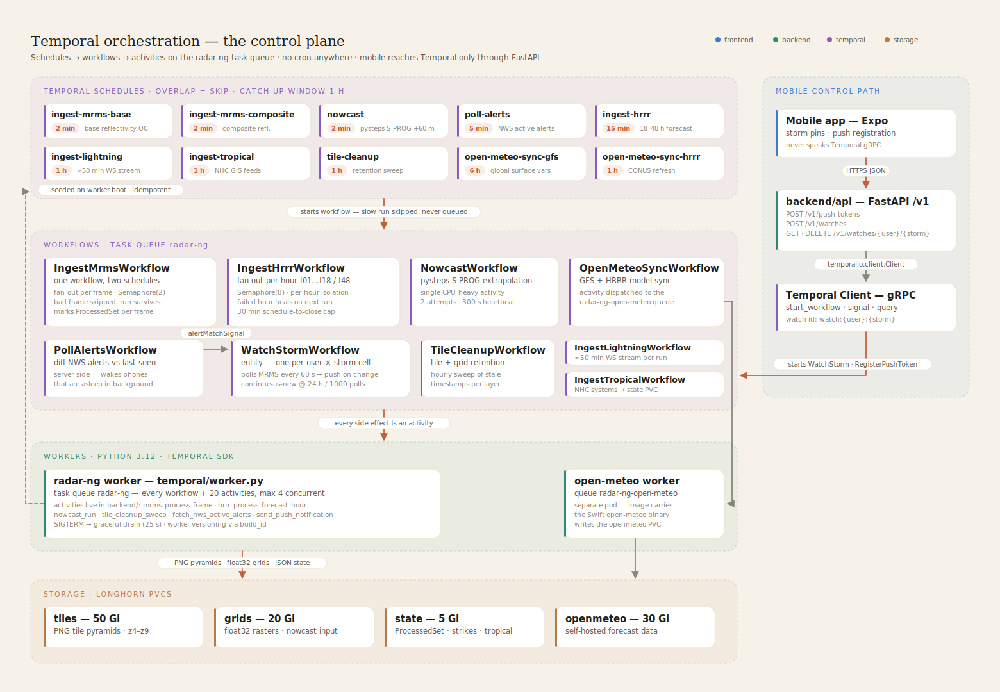
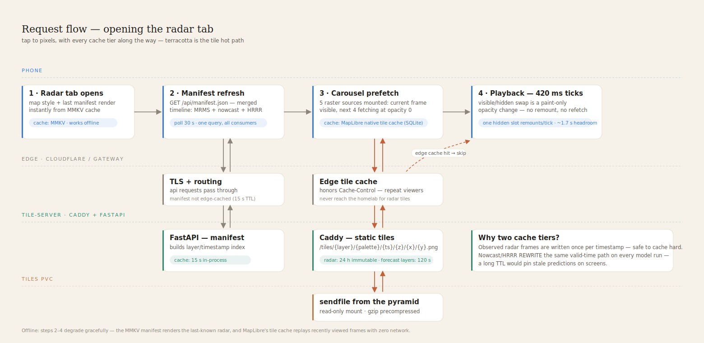
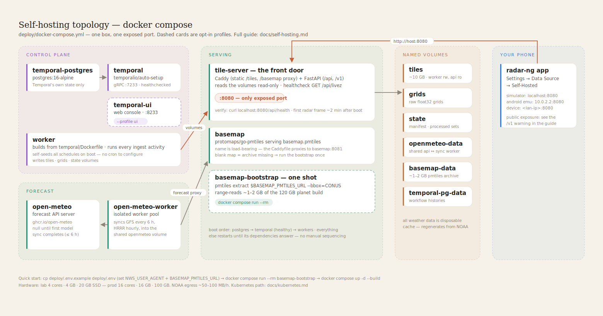

# Architecture

The phone app is the windshield; the Kubernetes pipeline is the engine. radar-ng pulls raw NOAA products (MRMS radar every 2 minutes, HRRR model runs hourly, lightning, tropical) onto hardware you own, rasterizes them into pre-rendered PNG tile pyramids on a PVC, and serves them as static files behind aggressive caching. Everything that runs on a timer is a Temporal Schedule driving a workflow; every workflow calls activities that live next to the service code in `backend/`. The Expo app is deliberately thin: it polls one manifest, mounts raster sources over a MapLibre basemap, and keeps its own state in zustand + MMKV so it works offline and cold-starts instantly.

---

## The system at a glance

**Full system: NOAA sources → Temporal orchestration → ingest → PVC storage → tile-server → edge → clients.**

| component | what it is | what it does | key files |
|---|---|---|---|
| `frontend/` | Expo SDK 57 app (bun) | MapLibre map + Skia wind particles; react-query data hooks, zustand + MMKV state, opt-in OTel client | `src/components/map/RadarOverlay.tsx` · `src/lib/radarCarousel.ts` · `src/stores/useWeatherStore.ts` · `src/lib/telemetry.ts` |
| `backend/api/` | the tile-server pod: Caddy in front of FastAPI | serves tile pyramids as static files, proxies `/api/*` + `/v1/*` to FastAPI, fronts the basemap; FastAPI holds the manifest/forecast/inspect/metrics endpoints and starts Temporal workflows for mobile | `Caddyfile` · `api/server.py` · `api/routes_workflows.py` · `start.sh` |
| `backend/ingest_mrms/` | MRMS radar activities | list/download/decode 2-min MRMS GRIB2 frames, render 3-palette tile pyramids, detect storm cells; env-driven prefix — the same code runs both `radar` and `radar-composite` | `activities.py` |
| `backend/ingest_hrrr/` | HRRR forecast activities | per-forecast-hour simulated reflectivity out to 18–48 h; secondary variables are capacity-gated | `activities.py` |
| `backend/ingest_lightning/` | Blitzortung consumer | long-running websocket activity, writes strikes to the state PVC | `activities.py` |
| `backend/ingest_tropical/` | NHC ingest | fetches NHC GIS feeds, publishes active systems | `activities.py` |
| `backend/nowcast/` | pysteps S-PROG | optical flow over recent MRMS grids → +60 min extrapolated radar tiles | `activities.py` |
| `backend/open_meteo_sync/` | Open-Meteo model sync | pulls GFS/HRRR open-data into the self-hosted forecast API's volume; runs on its own worker pool | `activities.py` |
| `backend/tile_cleanup/` | retention sweeper | hourly deletion of expired tile timestamps + grids (manifest first, then rmtree) | `activities.py` |
| `backend/shared/` | the data-plane library | atomic tile rendering, palettes, manifest read/write, `ProcessedSet` state, storm detection, JSON logger, activity heartbeat helper | `tiler.py` · `manifest.py` · `state.py` · `palettes.py` · `activity_heartbeat.py` · `logger.py` |
| `backend/basemap/` | Protomaps basemap | go-pmtiles serving a one-time CONUS PMTiles extract + style JSONs | `Dockerfile` · `styles/` |
| `temporal/` | the control plane | worker entrypoints, all workflow definitions, idempotent schedule seeding, OTel wiring | `worker.py` · `open_meteo_worker.py` · `workflows/` · `schedules/seed.py` |
| `deploy/` | deployment manifests | the docker-compose golden path, a local Temporal dev cluster, and reference k8s templates | `docker-compose.yml` · `temporal-dev.yml` · `k8s/` |

Rule of thumb: **workflows orchestrate, activities do I/O.** Workflow files in `temporal/workflows/` contain no wall-clock, randomness, or I/O; every download, decode, render, and delete happens in an activity defined in `backend/`.

---

## Life of a radar frame

**Per-frame lifecycle: 2-min MRMS cadence, 3-palette parallel render, atomic publish.**

Every 120 seconds the `ingest-mrms-base` Schedule fires `IngestMrmsWorkflow` (a second schedule, `ingest-mrms-composite`, drives the same workflow with a different MRMS prefix). `OverlapPolicy.SKIP` means a slow run drops the next trigger instead of stacking.

1. **List** — `mrms_list_unprocessed_keys` scans the NOAA S3 prefix (~200 ms), diffs against the `ProcessedSet` on the state PVC, and returns up to `BACKLOG_PER_CYCLE=3` keys, **newest first** — fresh radar beats backfill.
2. **Download + decode** — `mrms_process_frame` GETs the `.grib2.gz` object and pygrib-decodes it to a float32 lat×lon grid.
3. **Render** — the grid is rasterized into a z4–z7 PNG pyramid once per configured palette. The honest z7 ceiling avoids spending most of the render budget magnifying the ~1 km MRMS source.
4. **Atomic publish** — `render_tiles_atomic` renders into a unique sibling `<timestamp>.tmp-<uuid>` directory and renames it into an immutable final path. Concurrent retries cannot share or delete each other's staging directory, and existing final paths are never replaced. Forecast paths include their anchor/model run so two forecast cycles can never collide at the same valid time.
5. **Storm cells** — centroid detection over the grid → one JSON (~300 ms).
6. **Commit** — only after every configured palette has a non-empty pyramid, generation-pointer inspector and nowcast grids are written, manifest schema v2 publishes the frame metadata atomically, and the key is added to `ProcessedSet`.

One bad frame doesn't kill the run: per-frame errors are caught and logged, siblings continue, and the key is left unprocessed for the next cycle. The app discovers the new timestamp on its next manifest poll (≤30 s later).

Hot-path budget: the whole thing must land under the 2-minute MRMS cadence or `/api/health` flips to `degraded` (`MRMS_MAX_AGE_S=600`). The knobs that keep it under are in [docs/tuning.md](docs/tuning.md).

---

## Orchestration

**Temporal Schedules → workflows → activities → PVCs, plus the mobile → `/v1` → Temporal path.**

Everything periodic is a Temporal Schedule — there are no CronJobs and no crontabs. `temporal/schedules/seed.py` runs on every worker boot and create-or-updates all schedules by ID (idempotent; HA replicas racing converge on the same state; transient "shard warming up" RPC errors are retried with bounded backoff instead of crash-looping the pod). Bringing up a fresh stack requires zero manual scheduling steps.

| schedule | workflow | cadence |
|---|---|---|
| `ingest-mrms-base` / `ingest-mrms-composite` | `IngestMrmsWorkflow` | 2 min |
| `nowcast` | `NowcastWorkflow` | 2 min |
| `poll-alerts` | `PollAlertsWorkflow` | 5 min |
| `ingest-hrrr` | `IngestHrrrWorkflow` | 15 min |
| `ingest-lightning` | `IngestLightningWorkflow` | 60 min (activity streams ~50 min) |
| `ingest-tropical` | `IngestTropicalWorkflow` | 1 h |
| `tile-cleanup` | `TileCleanupWorkflow` | 1 h |
| `open-meteo-sync-hrrr` / `-gfs` | `OpenMeteoSyncWorkflow` | 1 h / 6 h |

Why Temporal instead of CronJobs — the concrete list:

- **`OverlapPolicy.SKIP` + 1 h catchup window.** A render that overruns its 2-min slot drops the next trigger instead of piling up; a worker that was down for an hour doesn't thundering-herd on recovery. Fresh data beats backfill for radar.
- **Retries with `schedule_to_close` budgets.** `start_to_close` bounds one attempt; `schedule_to_close` bounds the whole lifetime including retries and queue wait. `IngestHrrrWorkflow` gives each forecast hour 20 min per attempt but 30 min total (`temporal/workflows/ingest_hrrr.py`) — without the ceiling, 3 × 20-min attempts on one sick input pin the run while SKIP silently drops every fresh trigger.
- **Coherent model publication.** HRRR hours render into immutable `runs/<run-id>/<valid-time>` paths. The workflow publishes and marks a run processed only when every consecutive required hour contains reflectivity, so clients cannot mix forecast cycles or see a partial run.
- **Heartbeats.** `backend/shared/activity_heartbeat.py` pumps `activity.heartbeat()` from the event loop while CPU-bound work runs in a thread. A hung worker is detected in the heartbeat timeout (nowcast: 300 s) instead of waiting out the full `start_to_close` (15 min).
- **Worker versioning.** `WorkerDeploymentConfig` + `PINNED` (`temporal/worker.py`): in-flight workflows finish on the build they started on, new runs go to the new build — which is why the code has barely needed `workflow.patched()`.
- **Graceful drain.** SIGTERM triggers `worker.shutdown()`: polling stops and in-flight activities get `TEMPORAL_GRACEFUL_SHUTDOWN_S` (25 s) to finish before cancellation, instead of being killed mid-write.
- **State on disk, not in history.** Processed-key sets live in `ProcessedSet` files on the PVC; workflow history carries only small dataclasses. Temporal history is an event log replayed on recovery, not a database.

**Role-aware worker pools.** Local and migration-safe deployments default to the legacy `radar-ng` queue. Production can isolate `mrms`, `nowcast`, `hrrr`, `aux`, and `alerts` so a model fan-out cannot starve observed radar. Queue routing remains behind `USE_ISOLATED_TASK_QUEUES=0` until every role worker is deployed; the separate Open-Meteo worker keeps its own queue because its image carries the Swift binary.

**Mobile → Temporal.** The app never talks to Temporal directly. Workflow mutation routes are disabled in the cluster until a trusted identity issuer provides short-lived, per-user HMAC bearer tokens. When enabled, ownership checks bind every storm watch and push token to the authenticated subject; plaintext push credentials are stored outside immutable Temporal history.

---

## The app

**Hooks → zustand → MapLibre composition, including the 5-slot frame carousel.**

**Data-flow rules.** All server data flows `react-query hook → zustand (useWeatherStore) → component`. Components never fetch. MMKV persists user prefs (server URL, theme, palette, opacity, extras) *and* the last manifest — `useManifest` seeds react-query's `initialData` from MMKV with `initialDataUpdatedAt: 0`, so a cold start renders the radar instantly from cache and refetches immediately. The manifest is polled every 30 s; forecast, alerts, lightning, storms, and tropical each have their own hook and cadence.

**Storm-track prefetch.** Base-reflectivity ingest associates storm centroids across consecutive frames, keeps stable cell IDs, and extrapolates padded bboxes at 0, +5, and +10 minutes. `/api/storm-prefetch` ranks the nearest/highest-impact cell for the app's current location, resolves those three bboxes against published radar/nowcast frames, and returns only tile URLs that exist on disk. The iOS client gives the same three bboxes and minimal raster style URLs to MapLibre's native offline manager; ordinary JS HTTP/image prefetching is deliberately avoided because it does not warm MapLibre's native tile cache.

**The frame carousel.** A mounted MapLibre `RasterSource` cannot change its tile URL in place, so the naive timeline implementation remounted the source on every frame advance — unmount → refetch every visible tile → decode → render, every ~430 ms tick. Playback janked and scrubbing was worse. A first fix that preloaded 7 conditionally-mounted sources crashed iOS with an `NSRangeException` in `[MLRNMapView insertReactSubview:atIndex:]` — the native child *count* churned and the index bookkeeping desynced.

The carousel (`frontend/src/lib/radarCarousel.ts` + `RadarOverlay.tsx`) fixes both at once:

- **Five slots, constant child count.** Exactly `WINDOW = 5` raster sources are always mounted; slots are a keyed array that only ever replaces in place. Constant count is the property that avoids the iOS crash.
- **Opacity swap, not remount.** Advancing a frame flips `raster-opacity` between pre-mounted sources — a paint update on a live native layer, no remount. Hidden slots sit at opacity 0 but stay `visible`, so MapLibre fetches their tiles into its own cache (an HTTP-level prefetch would never reach MapLibre's resource loader).
- **One remount per tick, always hidden.** The modulo-padded slot assignment guarantees a +1 advance changes exactly one slot — the frame that just played, which becomes the farthest prefetch — giving each remounted slot (WINDOW−1) × tick ≈ 1.7 s to fetch before it's shown. The loop wrap is prefetched like any other frame.
- **Kill switch.** `WINDOW = 1` reproduces the old single-source behavior if a regression ever shows up on a real iPhone.

Two clamps keep the wire quiet: `SOURCE_MAX_ZOOM` (MRMS: 7, nowcast/HRRR: 6) tells MapLibre the real pyramid ceiling so it upsamples the top tile instead of firing 404s at zooms that don't exist, and `SOURCE_MIN_ZOOM = 4` stops world-scale requests that CONUS-only coverage would never answer.

Building and running the app: [docs/running-the-app.md](docs/running-the-app.md).

---

## Serving & caching

**Tap-to-pixels with every cache tier on the path.**

The tile-server pod runs **Caddy in front of FastAPI** (`backend/api/start.sh` launches both; the Caddyfile is the router). Caddy exists because a radar frame is ~12.6k small PNGs sitting on a PVC: Envoy — the Gateway API data plane at the edge — routes but cannot serve files, and serving static files through FastAPI would burn Python CPU per tile. Caddy's `file_server` (with `precompressed gzip`) does it for free, reverse-proxies `/api/*` and `/v1/*` to FastAPI on `127.0.0.1:8000`, and fronts go-pmtiles for the basemap.

| what | TTL | why |
|---|---|---|
| `/tiles/radar/*`, `/tiles/radar-composite/*` | **24 h, `immutable`** | observed MRMS frames are written exactly once per timestamp dir and never change — the playback loop replays past frames without re-fetching a single tile |
| `/tiles/*` forecast layers (nowcast, radar-hrrr, temperature, …) | **120 s** | every model run rewrites the **same valid-time path**; a long TTL would pin stale predictions |
| `/api/manifest.json` | 15 s server (`Cache-Control` + in-process TTL) / 30 s client poll | the freshness ceiling for discovering new frames |
| `/api/forecast/{lat}/{lon}` | 300 s + in-process cache | Open-Meteo proxy; keyed per rounded coordinate |
| `/basemap/styles/*` / `/basemap/tiles/*` | 1 h / 24 h | static Protomaps assets |
| client offline | MMKV | last manifest + all prefs persist on-device; cold start renders before the network answers |

The asymmetry in the first two rows is the whole caching story: **immutability is a property of the data, not the URL scheme.** Observed radar is append-only, so it caches hard; forecasts are replace-semantics, so they expire fast.

---

## Self-hosting shape

**The docker-compose stack — the same pipeline, one box.**

`deploy/docker-compose.yml` runs the identical architecture with containers standing in for pods: Temporal (auto-setup + postgres + UI), the two workers, the tile-server, self-hosted Open-Meteo, go-pmtiles (plus a one-shot basemap bootstrap), and named volumes standing in for the PVCs (tiles, grids, state, openmeteo-data, basemap-data). The worker seeds all Schedules on boot — `docker compose up -d` is the entire orchestration setup.

| guide | one line |
|---|---|
| [docs/self-hosting.md](docs/self-hosting.md) | the golden path: Compose on one machine, ~10 minutes to first radar frame |
| [docs/kubernetes.md](docs/kubernetes.md) | bring-your-own-cluster: PVCs, probes, HPA, the two worker Deployments, reference manifests in `deploy/k8s/` |
| [docs/tuning.md](docs/tuning.md) | every knob with a direction — zoom levels, palette count, worker concurrency, cadences |
| [docs/running-the-app.md](docs/running-the-app.md) | building the Expo dev client and pointing it at your server |

---

## Design decisions log

| decision | rationale |
|---|---|
| Tiles are files on a PVC, not object storage | ~12.6k small PNGs every 2 min is small-object churn that per-object PUT/GET overhead punishes; a directory `rename` is also the atomic commit primitive |
| z9 dropped from the radar pyramid | the top zoom level is ~75% of render wall-clock; with z9 frames arrived ~15 min stale, without it ~2 min — the client upsamples z8 instead (`SOURCE_MAX_ZOOM`) |
| Nowcast manifest uses replace-semantics | every nowcast run supersedes the last; incremental adds mixed fresh and stale vintages in one timeline (`replace_layer_manifest` in `backend/shared/manifest.py`) |
| 5-slot frame carousel, opacity swap | constant native child count avoids the iOS `insertReactSubview` crash; swapping opacity instead of remounting kills refetch jank; `WINDOW = 1` is the kill switch |
| Tiered caching split by data mutability | observed frames are write-once → 24 h immutable; forecast frames rewrite the same path → 120 s |
| Caddy inside the tile-server pod | Envoy at the edge routes but can't file-serve; FastAPI shouldn't spend Python cycles on static PNGs |
| Temporal Schedules over K8s CronJobs | SKIP overlap, catchup window, retry budgets, heartbeats, and per-item isolation are the difference between "stale radar self-heals" and "pager duty" |
| Separate open-meteo worker pool | the sync activity needs the Open-Meteo Swift binary in its image; registering it only on that worker makes Temporal do the routing |
| Ingest state in `ProcessedSet` files, not workflow history | history is a replayed event log, not a database; frame keys live on the PVC, history carries small dataclasses |
