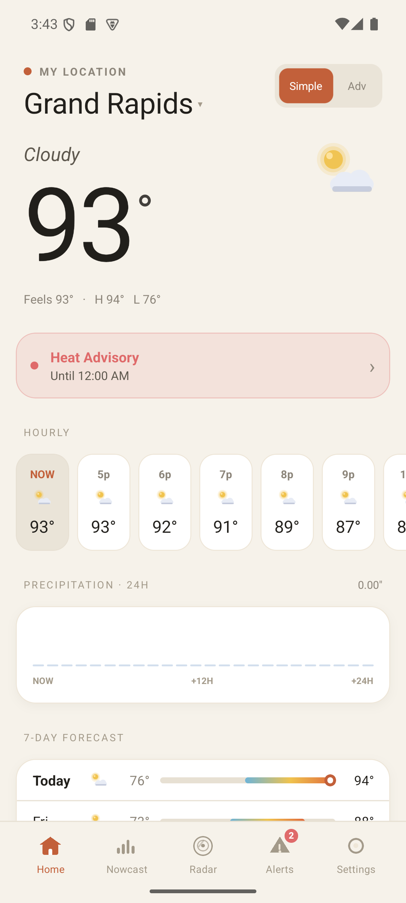
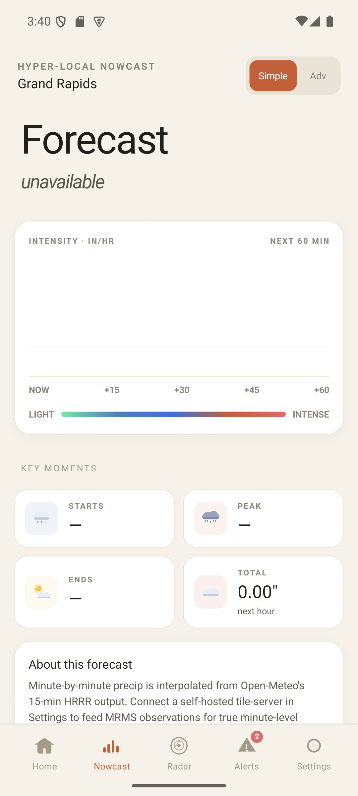
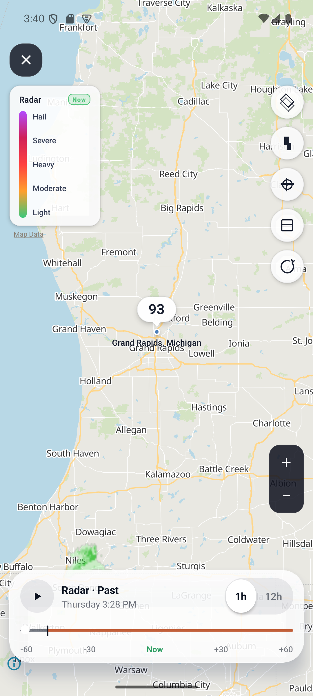
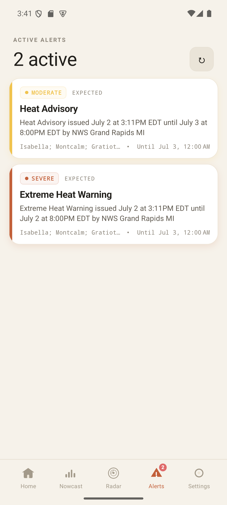
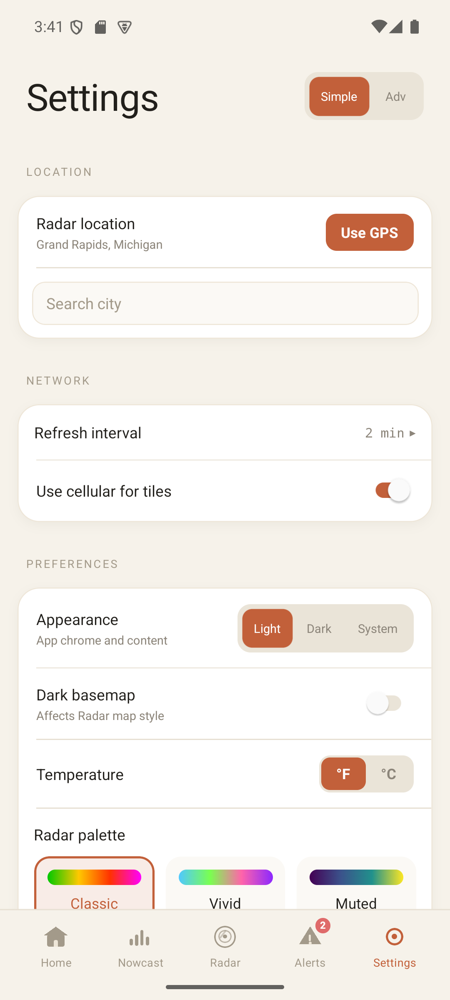
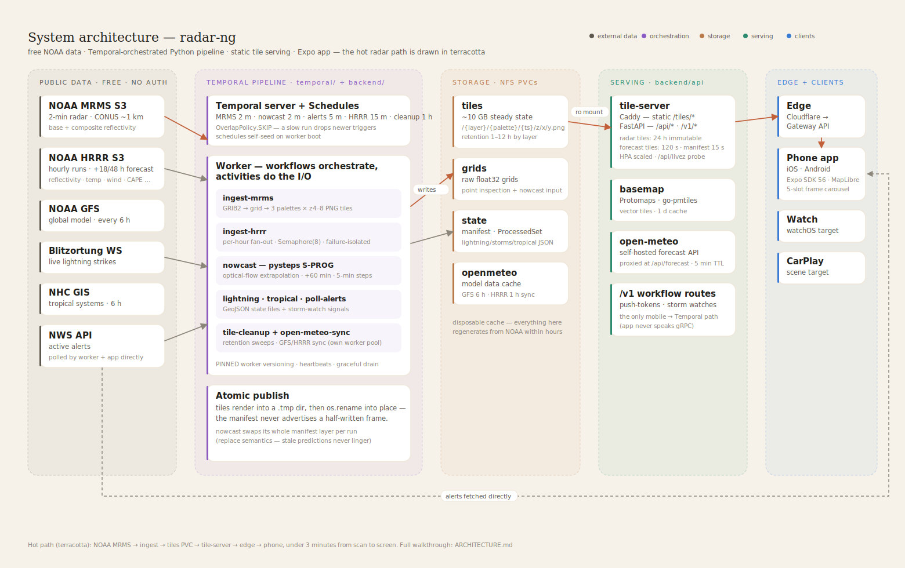

# radar-ng

> Self-hosted weather radar on a Python + Temporal tile pipeline. Pure public data, no aggregators, and no API keys.

[](https://expo.dev) [](https://www.python.org/) [](https://temporal.io) [](https://talos.dev)

<p align="center">
  
  
  
  
  
</p>

radar-ng pulls radar (NOAA MRMS), forecast (HRRR + Open-Meteo), alerts (NWS),
lightning (Blitzortung), and tropical (NHC) straight from the public sources,
renders map tiles on hardware you own, and serves them to a universal Expo app.
The phone is the windshield; a Kubernetes + Temporal pipeline is the engine.

## Quick start (Docker Compose)

```bash
cd deploy
cp .env.example .env
# set two values in .env:
#   NWS_USER_AGENT=(radar-ng, you@example.com)
#   BASEMAP_PMTILES_URL=   # newest date from https://build.protomaps.com/
docker compose run --rm basemap-bootstrap   # one-time basemap fetch
docker compose up -d
```

First radar frame lands ~2 min later. Point the app at `http://<host>:8080` (or
set it in Settings). Deploying to your own Kubernetes cluster and running the
app are covered in **[GETTING_STARTED.md](GETTING_STARTED.md)**.

Prebuilt images: `ghcr.io/mitchross/radar-ng-{tile-server,temporal-worker,open-meteo-worker}`.

## Local iOS/watch IPA

To build a signed standalone iPhone IPA with the watch app embedded, without
Metro or EAS:

```bash
cd frontend
bun run ios:ipa
```

The output lands at:

```text
frontend/build/ios-standalone/export-debugging/radarng.ipa
```

This is a `Release` Xcode archive/export. It embeds the Hermes `main.jsbundle`
and `Payload/radarng.app/Watch/radar-ngWatch.app`, so the installed app does
not need a Metro server.

The default export method is `debugging`, which is standalone but still
development-signed with the Apple account configured in Xcode. For a true
distribution-style install path, use:

```bash
cd frontend
bun run ios:ipa:release-testing   # ad-hoc / release testing
bun run ios:ipa:app-store         # App Store Connect / TestFlight
```

`release-testing` requires the latest Apple Developer Program License Agreement
to be accepted, an installed Apple Distribution certificate with private key, and
provisioning profiles for both `com.vanillax.radar-ng` and
`com.vanillax.radar-ng.watch`.

## How it works



Every ingest step is a Temporal activity, scheduled by Temporal Schedules (no
cron). The tile-server is Caddy — static tile serving off disk + immutable cache
headers + one-port routing — in front of FastAPI/uvicorn. The component-by-
component breakdown, the per-frame pipeline, and the caching story are in
**[ARCHITECTURE.md](ARCHITECTURE.md)**.

## Docs

| Doc | For |
|---|---|
| [GETTING_STARTED.md](GETTING_STARTED.md) | Run the stack (Compose or k8s) + the app |
| [docs/configuration.md](docs/configuration.md) | Every env var + the basemap-date gotcha |
| [docs/self-hosting.md](docs/self-hosting.md) | Docker Compose golden path |
| [docs/kubernetes.md](docs/kubernetes.md) | Bring-your-own-cluster (Temporal, storage, probes) |
| [docs/tuning.md](docs/tuning.md) | Faster / cheaper / fresher, knob by knob |
| [docs/debug-harness.md](docs/debug-harness.md) | Inspect a live stack: freshness, latency, Temporal, disk |
| [ARCHITECTURE.md](ARCHITECTURE.md) | How it all fits together |
| [CONTRIBUTING.md](CONTRIBUTING.md) | Dev setup, verification, conventions |

## Data sources

All free, public, no keys: **NOAA MRMS** (radar) · **NOAA HRRR** + **Open-Meteo**
(forecast) · **NWS** (alerts) · **NHC** (tropical) · **Blitzortung** (lightning)
· **Protomaps** (basemap).

## Stack

Expo SDK 57 / TypeScript · MapLibre · Skia · Python 3.12 (pygrib · numpy ·
Pillow · FastAPI) · Caddy 2 · Temporal · Open-Meteo · Protomaps · Kubernetes
(Talos + ArgoCD) · OpenTelemetry.

## License

See [LICENSE](LICENSE).
