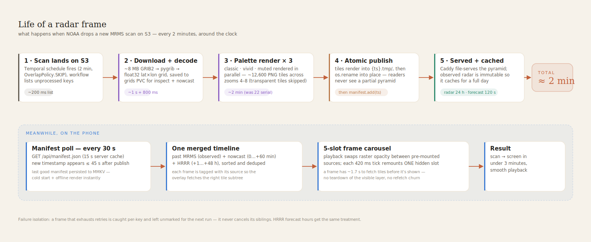
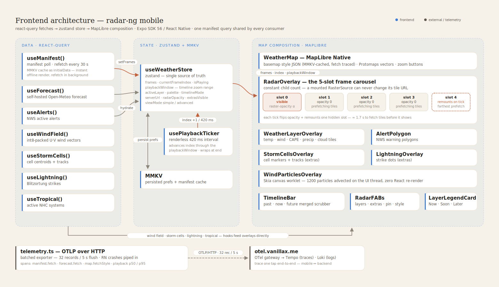

# radar-ng

> Hyper-local weather radar with a self-hosted tile pipeline. CARROT-Weather UI energy, NWS-grade data, runs on your homelab.

[](https://radar-ng-api.vanillax.me/api/health) [](https://expo.dev) [](https://www.python.org/) [](https://talos.dev) [](https://argo-cd.readthedocs.io/) [](https://opentelemetry.io)

<p align="center">
  
  
  
  
  
</p>

**How it all works → [ARCHITECTURE.md](ARCHITECTURE.md)** — every component, the per-frame pipeline, Temporal orchestration, the frame carousel, and the caching story, with diagrams.

---

## Why this exists

Commercial radar apps rate-limit you, slap ads on the freezing-rain warning, and round your zip code to the nearest 5 miles. radar-ng is the opposite: pure NOAA data, sub-2-minute refresh, every layer the public APIs offer, **rendered on hardware you own**. The phone app is the windshield. The Kubernetes pipeline is the engine.

| | radar-ng | most weather apps |
|---|---|---|
| Radar latency | < 3 min from NOAA | 5–15 min |
| Data source | Direct NOAA MRMS / HRRR / NLDN | Third-party aggregator |
| Forecast | Self-hosted Open-Meteo | Vendor-locked |
| Privacy | Your server, your tiles | Sells your location |
| Layer count | 8+ (radar · composite · temp · wind · CAPE · precip type · rain · cloud · lightning · tropical · nowcast) | 1–3 |
| Cost at scale | $0 (you pay power) | Tier-gated |
| Trace one tap end-to-end | yes — Tempo + Loki | no |

---

## Getting started

| I want to… | read |
|---|---|
| **Run the whole stack on my own hardware** (Docker Compose, ~10 min) | **[docs/self-hosting.md](docs/self-hosting.md)** |
| Build + run the mobile app | [docs/running-the-app.md](docs/running-the-app.md) |
| Deploy on Kubernetes (probes, PVCs, HPA) | [docs/kubernetes.md](docs/kubernetes.md) |
| Make it faster / cheaper / fresher | [docs/tuning.md](docs/tuning.md) |
| Sideload CarPlay + Apple Watch | [docs/carplay-watch-setup.md](docs/carplay-watch-setup.md) |

The short version: `docker compose up -d` in `deploy/`, one ~1–2 GB basemap bootstrap, point the app at `http://your-server:8080`. First radar frame ~2 minutes later. All data sources are free — no API keys, no accounts.

---

## System architecture


**Full system: NOAA sources → Temporal → ingest → PVC storage → tile-server → edge → clients.**

**Orchestration:** every box in the ingest layer runs as a Temporal activity, scheduled by Temporal Schedules (no cron). Workflows + worker live in `temporal/`; activity implementations live alongside each service in `backend/`. Mobile → `backend/api/` → `temporalio.client.Client` → workflow start. The full story — schedules, retry budgets, failure isolation — is in [ARCHITECTURE.md](ARCHITECTURE.md#orchestration).

Every box runs on a Talos Linux cluster managed by ArgoCD. Manifests live in [`talos-argocd-proxmox/my-apps/development/radar-ng/`](https://github.com/mitchross/talos-argocd-proxmox/tree/main/my-apps/development/radar-ng).

---

## Per-frame data pipeline

What happens when NOAA drops a new MRMS scan on S3:



**Per-frame lifecycle: 2-min MRMS cadence, 3-palette parallel render, atomic publish.** Prose walkthrough: [ARCHITECTURE.md → Life of a radar frame](ARCHITECTURE.md#life-of-a-radar-frame).

Hot-path numbers (post Phase-2 perf work):

| stage | input | output | duration |
|---|---|---|---|
| S3 list | prefix scan | 12 keys | ~ 200 ms |
| GRIB2 download | latest object | 8 MB | ~ 1 s |
| pygrib decode | gzipped GRIB | float32 grid | ~ 800 ms |
| **palette render** ×3 | float32 → RGBA → PNG pyramid | 12 600 PNGs | **~ 2 min parallel** (was ~22 min serial) |
| storm-cell detect | grid → JSON | 1 file | ~ 300 ms |
| **total per frame** | — | — | **≈ 2 min** |

---

## Frontend architecture



**Hooks → zustand → MapLibre composition, including the 5-slot frame carousel.** Why the carousel exists (and the iOS crash it dodges): [ARCHITECTURE.md → The app](ARCHITECTURE.md#the-app).

**Stack rules**

- All server data flows `react-query → zustand → component`
- MMKV persists user prefs (server URL, theme, palette, opacity, extras-visible)
- OTel client (`frontend/src/lib/telemetry.ts`) ships traces + logs to `otel.vanillax.me/v1/traces` and `/v1/logs` — see [Observability](#observability)
- 5 raster sources mounted at all times in `RadarOverlay` (constant child count — load-bearing on iOS) so timeline scrubbing doesn't unmount/refetch

---

## Observability — full pipeline

You can trace a single tap on the radar tab end-to-end through the mobile span → backend span → ingest log line, all keyed by a shared trace ID.

| signal | path |
|---|---|
| mobile traces + logs | `telemetry.ts` → OTLP/HTTP → otel-gateway ×2 → Tempo / Loki |
| backend logs | `shared/logger.py` JSON → kubelet stdout → otel-agent DaemonSet → otel-gateway → Loki (OTel semconv labels) |
| backend metrics | tile-server `/api/metrics` → ServiceMonitor scrape → Prometheus |
| dashboards | Grafana (grafana.vanillax.me) reads all three |

### What's deployed

| component | namespace | role |
|---|---|---|
| `opentelemetry-operator` | `opentelemetry` | manages collectors |
| `otel-agent-collector` (DaemonSet, 7 pods) | `opentelemetry` | scrapes node + pod logs/metrics |
| `otel-gateway-collector` (2 replicas) | `opentelemetry` | OTLP receiver, fans out to Tempo/Loki/Prom |
| `loki-stack` (gateway, backend, read, write, chunks-cache) | `loki-stack` | log storage |
| `kube-prometheus-stack` (Prom + Grafana + Alertmanager) | `prometheus-stack` | metrics + dashboards |
| `tile-server` `/api/metrics` → ServiceMonitor | `radar-ng` | Prometheus scrape target |
| `radar-ng-dashboard` ConfigMap | `prometheus-stack` | auto-imports into Grafana |

### Mobile app instrumentation

`frontend/src/lib/telemetry.ts` wires:

```ts
// Wrap any async op in a span — records exceptions, sets error status
await trace("manifest.fetch", async (span) => {
  span.setAttribute("server", serverUrl);
  return await fetch(`${serverUrl}/api/manifest.json`).then(r => r.json());
});

// Or emit a structured log event
logEvent("warn", "tile fetch slow", { url, duration_ms: 4200 });
```

The OTLP exporter ships in batches (32 records / 5 s flush) to `otel.vanillax.me/v1/traces` and `/v1/logs`. Service name = `radar-ng-mobile`. Resource attributes include platform, OS version, app version. RN's global error handler is also piped in so red-screen crashes show up in Loki.

### Backend instrumentation

`backend/shared/logger.py` writes one-line JSON per record:

```json
{"ts":"2026-04-28T05:18:12+0000","level":"INFO","service":"ingest-mrms","msg":"rendered","layer":"radar","palette":"classic","timestamp":"2026-04-28T05:18:12+00:00","tiles":4264}
```

Kubelet picks up stdout, otel-agent forwards to gateway, gateway labels with OTel semconv (`k8s_namespace_name`, `k8s_pod_name`, `service_name`) and writes to Loki.

`tile-server` additionally exports Prometheus metrics at `/api/metrics`:

```
radar_ng_forecast_requests_total          counter
radar_ng_forecast_cache_hits_total        counter
radar_ng_forecast_upstream_errors_total   counter
radar_ng_manifest_requests_total          counter
radar_ng_tile_timestamps{layer="radar"}   gauge
radar_ng_mrms_age_seconds                 gauge
```

### Grafana dashboard panels

`monitoring/prometheus-stack/radar-ng-dashboard.yaml` — auto-imported, currently shows:

| panel | query / source |
|---|---|
| MRMS radar data age (s) | `radar_ng_mrms_age_seconds` |
| tile-server requests/sec by endpoint | rate of `radar_ng_*_requests_total` |
| Forecast cache hit % | `radar_ng_forecast_cache_hits_total / requests_total` |
| Log volume by container | Loki count over time, by `k8s_container_name` |
| Recent error lines (radar-ng) | Loki `{namespace} \|~ "(?i)error"` |
| Tile timestamps per layer | `radar_ng_tile_timestamps{layer="…"}` |
| Pod CPU vs request | `kube_pod_container_resource_requests`-relative |
| Pod memory vs limit | same |
| HPA replicas (tile-server) | `kube_horizontalpodautoscaler_status_current_replicas` |
| OOM kills (1 h) | `increase(kube_pod_container_status_last_terminated_reason{reason="OOMKilled"}[1h])` |
| Container restarts (1 h) | `increase(kube_pod_container_status_restarts_total[1h])` |

### Loki query cookbook

Bookmark these in Grafana → Explore (Loki):

```logql
# Every error/warn line across radar-ng (last 1h)
{k8s_namespace_name="radar-ng"} |~ "(?i)error|warn|exception|traceback"

# Specifically ingest-mrms render cycle timings
{k8s_namespace_name="radar-ng", k8s_pod_name=~"ingest-mrms.*"}
  | json
  | msg = "frame_done"
  | line_format "{{.timestamp}} took {{.duration_s}}s"

# Tile-server slow requests (> 1s)
{k8s_namespace_name="radar-ng", k8s_pod_name=~"tile-server.*"}
  | json
  | duration > 1.0

# Mobile app errors (red-screen crashes captured by global handler)
{service_name="radar-ng-mobile"} |= "ERROR"

# Find any log entry with a given trace ID (paste in trace_id from Tempo)
{k8s_namespace_name="radar-ng"} |= "<trace_id>"
```

### Trace cookbook

In Grafana → Explore (Tempo), search by service name `radar-ng-mobile`. Spans of interest:

- `manifest.fetch` — root span when the radar tab loads
- `tile.fetch` — when MapLibre asks for a tile (currently unwrapped — could be added)
- `forecast.fetch` — home tab forecast load
- `map.fetchStyle` — basemap style JSON load (already instrumented in `WeatherMap.tsx`)

Click a span → "Logs for this span" → Loki shows backend lines correlated by trace ID.

---

## Data sources

The app runs against two interchangeable tiers:

| tier | what serves it | layers |
|---|---|---|
| **free** (no server needed) | IEM NEXRAD 5-min radar tiles · Open-Meteo public API (10 k req/day) · NWS public alerts API | radar, forecast, alerts |
| **self-hosted** (this repo) | your radar-ng tile server | everything in the matrix below |

Switch in **Settings → Data Source**. Both can run side-by-side; the manifest fetch determines which layers are available.

### Self-hosted layer matrix

| layer | source | cadence | resolution | retention | tile path |
|---|---|---|---|---|---|
| **radar** | MRMS MergedBaseReflectivityQC_00.50 | 2 min | ~1 km | 4 h | `/tiles/radar/{palette}/{ts}/` |
| **radar-composite** | MRMS MergedReflectivityQComposite | 2 min | ~1 km | 4 h | `/tiles/radar-composite/{palette}/{ts}/` |
| **radar-hrrr** | HRRR composite reflectivity | 1 h × 18 hr | 3 km | 8 h | `/tiles/radar-hrrr/{palette}/{ts}/` |
| **temperature** | HRRR 2 m temp | 1 h × 24 hr | 3 km | 8 h | `/tiles/temperature/{ts}/` |
| **wind** | HRRR 10 m U + V | 1 h × 24 hr | 3 km | 8 h | `/tiles/wind/{ts}/` (+ vector grid) |
| **cape** | HRRR convective energy | 1 h × 24 hr | 3 km | 8 h | `/tiles/cape/{ts}/` |
| **precip-type** | HRRR categorical | 1 h × 24 hr | 3 km | 8 h | `/tiles/precip-type/{ts}/` |
| **precip-accum** | HRRR APCP | 1 h × 24 hr | 3 km | 8 h | `/tiles/precip-accum/{ts}/` |
| **cloud** | HRRR total cloud cover | 1 h × 24 hr | 3 km | 8 h | `/tiles/cloud/{ts}/` |
| **nowcast** | pysteps S-PROG of MRMS | 2 min × +60 min | 1 km | 1 h | `/tiles/nowcast/{palette}/{ts}/` |
| **lightning** | Blitzortung WS | 1 min | strikes | 1 h | `/api/lightning` |
| **tropical** | NHC GIS feeds | 6 h | track | 7 d | `/api/tropical` |

### Roadmap (more free MRMS products on the same S3 bucket)

| product | premium-app feature it replaces |
|---|---|
| `MESH_Max_30min` | hail-size circles (RadarOmega Pro) |
| `RotationTrackML_30min` | mid-level rotation tracks (RadarScope Pro) |
| `EchoTop_18` | convective storm height |
| `VIL` | vertically integrated liquid (storm severity) |
| `MultisensorQPE_24H_Pass2` | 24-h rainfall total, gauge-corrected |
| `WinterPrecipType` | rain/snow/sleet/freezing-rain |

Each new layer reuses the same `ingest-mrms` image with a different `MRMS_PREFIX` env var — see `deployment-ingest-radar-composite.yaml` for the pattern.

---

## API surface

| endpoint | method | description | cache |
|---|---|---|---|
| `/api/health` | GET | `ok` / `degraded` (mrms staleness) | none |
| `/api/manifest.json` | GET | layers, timestamps, palettes | 15 s |
| `/api/forecast/{lat}/{lon}` | GET | Open-Meteo proxy | 5 min |
| `/api/inspect/{layer}/{ts}/{lat}/{lon}` | GET | bilinear point-sample of raw grid | 60 s |
| `/api/wind-field/{ts}` | GET | int8-packed U/V vectors | 5 min |
| `/api/storms/{ts}` | GET | detected cell centroids + tracks | 60 s |
| `/api/lightning?since=…` | GET | Blitzortung strikes | 30 s |
| `/api/tropical` | GET | active NHC systems | 5 min |
| `/api/metrics` | GET | Prometheus counters + gauges | none |
| `/tiles/{layer}/{palette}/{ts}/{z}/{x}/{y}.png` | GET | static tile (Caddy) | radar: 24 h immutable · forecast: 120 s |
| `/basemap/styles/*` | GET | Protomaps style JSON | 1 h |
| `/basemap/tiles/{z}/{x}/{y}.mvt` | GET | vector basemap | 1 d |

```bash
$ curl https://radar-ng-api.vanillax.me/api/health
{"status":"ok","mrms_age_s":118,"mrms_max_age_s":600,"reasons":[],"checked_at":"2026-04-28T05:18:12Z"}
```

If `mrms_age_s` exceeds `MRMS_MAX_AGE_S` (default 600 s) the status flips to `degraded` — useful for paging or for the app to show a "data delayed" banner.

---

## Operations — Talos + Argo

This section documents the **author's** cluster. For running radar-ng on your own Kubernetes, see [docs/kubernetes.md](docs/kubernetes.md).

**Two repos:**
- `radar-ng` (this repo, Gitea) — `frontend/` Expo app · `backend/` Python services · `temporal/` workflows + worker · `deploy/` compose & k8s · `.gitea/` CI
- `talos-argocd-proxmox` (GitHub) — gitops manifests, Argo source-of-truth

**Push flow:**
1. Push code changes to `radar-ng`. CI builds + pushes images to `registry.vanillax.me/radar-ng-*:vN.N.{N+1}`
2. Bump image tags in `talos-argocd-proxmox/my-apps/development/radar-ng/deployment-*.yaml`
3. Push gitops repo → Argo webhook → `Synced` → pods roll

**Disaster recovery for failed CI:** trigger `.gitea/workflows/retag-from-latest.yml` via Gitea Actions UI. Pulls `:latest`, computes next semver, re-tags, pushes. Used when basemap CI flakes and a child workflow needs a fresh `:vN.N.N` to exist.

**Cluster:** 3 control planes + 4 workers (incl. 1 GPU node), Talos v1.13.0-rc.0, k8s 1.35. Storage via Longhorn (3-replica).

---

## Self-hosting

Full guide: **[docs/self-hosting.md](docs/self-hosting.md)** (Docker Compose golden path) · [docs/kubernetes.md](docs/kubernetes.md) (bring-your-own-cluster) · [docs/tuning.md](docs/tuning.md) (every knob, with directions).

| profile | hosts | min | recommended |
|---|---|---|---|
| **lab** | docker-compose, single node | 4 cores · 4 GB · 20 GB SSD | 8 cores · 8 GB · 50 GB SSD |
| **prod** | full K8s + HRRR + nowcast | 16 cores · 16 GB · 100 GB SSD | 24 cores · 32 GB · 200 GB NVMe |

NOAA pull ≈ 50–100 MB/h. Steady-state disk ≈ 5 GB; spikes to ~10 GB during HRRR runs.

```bash
cd deploy && cp .env.example .env             # set NWS_USER_AGENT + BASEMAP_PMTILES_URL
docker compose run --rm basemap-bootstrap     # one-time ~1–2 GB CONUS extract
docker compose up -d --build

# wait ~2 min for first MRMS frame
curl http://localhost:8080/api/health
curl -s http://localhost:8080/api/manifest.json | jq '.layers | keys'
```

Orchestration is Temporal end-to-end: the `worker` container seeds all Schedules idempotently on boot — no cron, no CronJobs, no manual step.

---

## Building the app

Full guide: **[docs/running-the-app.md](docs/running-the-app.md)**. TL;DR — the Expo project lives in `frontend/`, uses bun, and needs a dev build (native modules; Expo Go won't work):

```bash
cd frontend
bun install
bun run android      # or: bun run ios (macOS only)
```

Then **Settings → Data Source → Self-Hosted → `http://<lan-ip>:8080`** (Android emulator: `http://10.0.2.2:8080`, iOS simulator: `http://localhost:8080`). CarPlay + Apple Watch sideload lives in [docs/carplay-watch-setup.md](docs/carplay-watch-setup.md).

---

## Project layout

The repo is split into three top-level apps + deploy/docs/CI. **Expo, Python services, and Temporal workflows are deliberately separate trees** — each has its own dependencies, Dockerfile, and CI workflow.

```
radar-ng/
├─ frontend/                  📱 Expo / React Native app (bun)
│  ├─ src/
│  │  ├─ app/                    file-based routing (expo-router)
│  │  ├─ components/             map · timeline · home · inspector · alerts
│  │  │  ├─ home/RadarMiniMap.tsx       home-tab radar preview
│  │  │  ├─ map/WeatherMap.tsx          MapLibre wrapper + zoom buttons
│  │  │  ├─ map/RadarOverlay.tsx        5-slot raster frame carousel
│  │  │  ├─ map/RadarFABs.tsx           layer picker · ⚡ extras · pin · style
│  │  │  ├─ map/LayerLegendCard.tsx     Now/Soon/Later tag + color scale
│  │  │  └─ timeline/TimelineBar.tsx    merged past·now·future scrubber
│  │  ├─ hooks/                  react-query data hooks
│  │  ├─ lib/                    api · constants · telemetry · tileUrl
│  │  ├─ stores/useWeatherStore.ts   zustand · MMKV-persisted
│  │  └─ types/weather.ts        TS interfaces
│  ├─ assets/                    images · fonts
│  ├─ plugins/                   Expo config plugins (CarPlay, ScriptSandboxOff)
│  ├─ targets/                   extra Apple targets — source of truth
│  │  ├─ watch/                    watchOS app
│  │  └─ carplay/                  CarPlay scene (copied into ios/ by plugin)
│  ├─ scripts/                   dev helpers
│  ├─ __tests__/                 Jest tests
│  ├─ app.json · metro.config.js · package.json · tsconfig.json
│  └─ ios/  android/             generated by `expo prebuild` — gitignored
├─ backend/                  ⚙️ Python services (FastAPI · Temporal activities)
│  ├─ shared/                    tiler · palettes · state · logger · storms
│  ├─ api/                       Caddy + FastAPI tile-server
│  ├─ base/                      shared base Docker image
│  ├─ basemap/                   Protomaps go-pmtiles
│  ├─ ingest_mrms/               MRMS radar (Temporal activities, env-driven)
│  ├─ ingest_hrrr/               HRRR forecast (5 vars)
│  ├─ ingest_lightning/          Blitzortung WS
│  ├─ ingest_tropical/           NHC GIS
│  ├─ nowcast/                   pysteps S-PROG extrapolation
│  ├─ open_meteo_sync/           Open-Meteo data sync (Temporal-driven)
│  ├─ tile_cleanup/              tile retention sweeper
│  ├─ scripts/                   ops helpers
│  └─ pmtiles-data/              Protomaps basemap source tiles
├─ temporal/                 🎼 Temporal worker + workflows (orchestrates backend/)
│  ├─ workflows/                 IngestMrms · IngestHrrr · Lightning · Tropical
│  │                             Nowcast · TileCleanup · PollAlerts · WatchStorm
│  ├─ schedules/seed.py          idempotent schedule registration on boot
│  ├─ shared/                    worker bootstrap · OTEL setup
│  ├─ worker.py                  main worker entry (all task queues)
│  ├─ open_meteo_worker.py       isolated worker pool for open-meteo
│  ├─ Dockerfile · open_meteo_worker.Dockerfile
│  └─ requirements.txt
├─ deploy/                   🚢 deployment manifests
│  ├─ docker-compose.yml         the self-hosting golden path (docs/self-hosting.md)
│  ├─ .env.example               compose configuration template
│  ├─ temporal-dev.yml           local Temporal dev cluster
│  └─ k8s/                       reference manifests for Kubernetes (docs/kubernetes.md)
├─ docs/                     guides (self-hosting · kubernetes · running-the-app · tuning) · specs · plans
└─ .gitea/workflows/         CI: per-service build-* + retag-from-latest
```

### Why three top-level dirs

- **`frontend/` is a self-contained Expo project.** Its `node_modules`, `bun.lock`, Metro/TS configs, and prebuilt `ios/`/`android/` all live under it. Run `bun` commands from `frontend/`, not the repo root.
- **`backend/` is all Python data-plane code.** Each service has its own Dockerfile and is built by a dedicated `.gitea/workflows/build-*.yml`. The `shared/` package is consumed by every service.
- **`temporal/` is the control plane.** All seven former K8s CronJobs are now Temporal Schedules. Workflows orchestrate; activities (defined in `backend/`) do all I/O. Mobile never talks to Temporal directly — it goes through `backend/api/`, which uses the `temporalio` Python client.

---

## Tech stack at a glance

| layer | stack |
|---|---|
| 📱 frontend | Expo SDK 56 · React Native 0.85 · React 19.2 · MapLibre Native · Shopify Skia · Zustand 5 · TanStack Query 5 · OpenTelemetry SDK |
| ⚙️ backend | Python 3.12 · pygrib · numpy · Pillow · FastAPI · Caddy 2 |
| 🎼 orchestration | Temporal (Schedules · workflows · versioned workers) |
| ☁️ infra | Talos Linux · Kubernetes 1.35 · ArgoCD · Longhorn · Gateway API · Cloudflare |
| 📊 observability | OTel Operator + Gateway · Tempo · Loki · Prometheus · Grafana |

---

## Performance notes

The knob-by-knob operator's guide is [docs/tuning.md](docs/tuning.md); this is the history of what landed. Phase-2 fixes:

- **Palette render parallelized** with `ThreadPoolExecutor(3)` — PIL releases the GIL during PNG encode; three palettes finish in roughly the time of one.
- **`PNG optimize=False, compress_level=1`** — tiles are short-lived and Caddy gzips on the wire; the extra zlib pass halved throughput for ~5 % size win.
- **`Image.BILINEAR` resize** on tile render — crisper edges than NEAREST.
- **Backlog catch-up** — `BACKLOG_PER_CYCLE=3`, newest-first, state committed per frame.
- **Resource bumps** — ingest-mrms now 6 cpu / 6 Gi; OOMKilled count went from 7/day to 0.
- **Radar frame carousel** — 5 raster sources mounted at once on the client, playback flips opacity between them; scrubbing/playing the timeline no longer unmounts → re-fetches → renders.
- **`rasterFadeDuration: 120 ms` + `rasterResampling: linear`** — smooth frame transitions, smooth display-side scaling.
- **Per-frame state commits** — eliminated the bug where the backlog of unprocessed keys was being marked done without rendering.

End result: per-frame total ≈ 2 min (was ≈ 22 min). MRMS staleness budget (`MRMS_MAX_AGE_S=600`) holds. Mobile playback feels like a native weather app, not a tech demo.

---

## License

MIT
