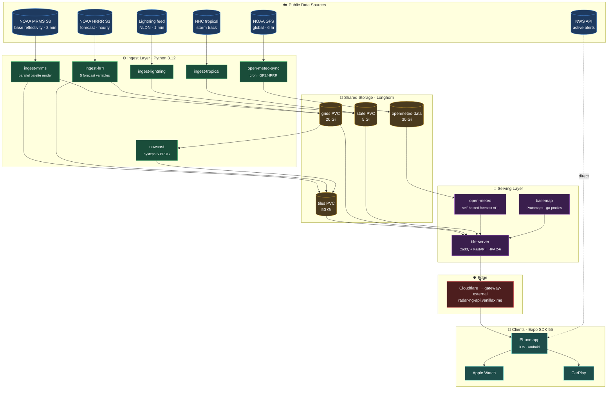
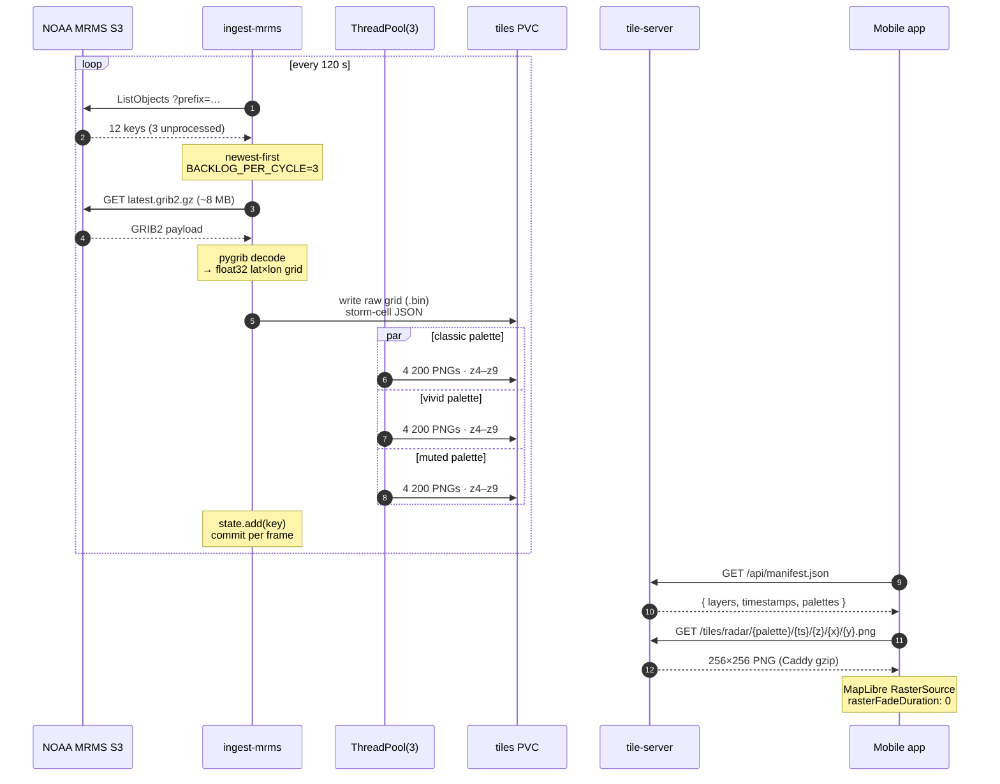
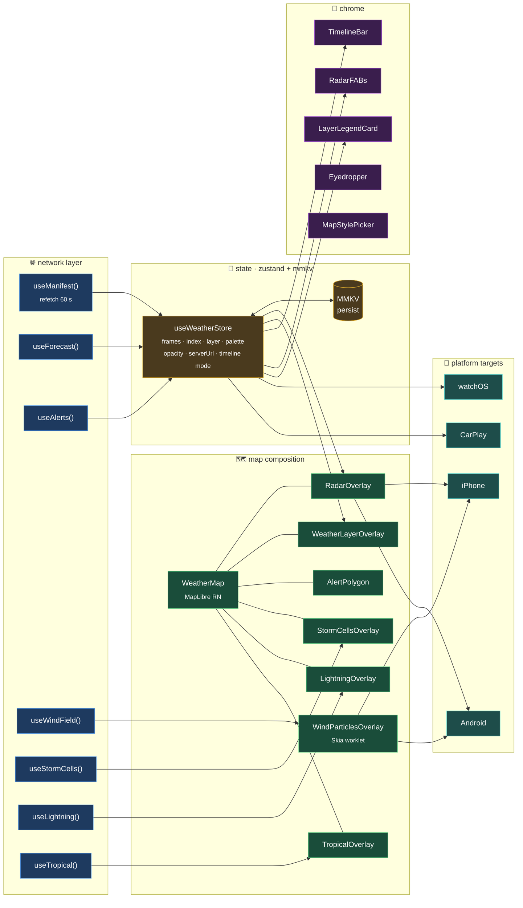
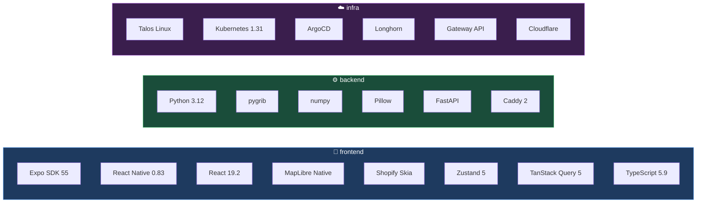

# StormScope · radar-ng

> Hyper-local weather radar with a self-hosted tile pipeline. CARROT-Weather UI energy, NWS-grade data, runs on a homelab.

[](https://radar-ng-api.vanillax.me/api/health) [](https://expo.dev) [](https://www.python.org/) [](https://argo-cd.readthedocs.io/)


---

## Why this exists

Commercial radar apps rate-limit you, slap ads on the freezing-rain warning, and round your zip code to the nearest 5 miles. StormScope is the opposite: pure NOAA data, sub-2-minute refresh, every layer the public APIs offer, **rendered on hardware you own**. The phone app is the windshield. The Kubernetes pipeline is the engine.

| | StormScope | Most weather apps |
|---|---|---|
| Radar latency | < 3 min from NOAA | 5–15 min |
| Data source | Direct NOAA MRMS / HRRR | Third-party aggregator |
| Forecast cache | Self-hosted Open-Meteo | Vendor-locked |
| Privacy | Your server, your tiles | Sells your location |
| Layer count | 8 (radar, temp, wind, CAPE, precip-type, precip-accum, cloud, lightning, tropical, nowcast) | 1–3 |
| Cost at scale | $0 (you pay power) | Tier-gated |

---

## System architecture



**One namespace, ten workloads, one promise:** every box runs on a Talos Linux cluster managed by ArgoCD, manifests in [`talos-argocd-proxmox/my-apps/development/radar-ng`](https://gitea.vanillax.me/vanillax/talos-argocd-proxmox).

---

## Per-frame data pipeline

What happens when NOAA drops a new radar scan on S3:



**Hot path numbers** (after Phase 2 perf work):

| stage | input | output | duration |
|---|---|---|---|
| S3 list | prefix scan | 12 keys | ~ 200 ms |
| GRIB2 download | latest object | 8 MB | ~ 1 s |
| pygrib decode | gzipped GRIB | float32 grid | ~ 800 ms |
| **palette render** ×3 | float32 → RGBA → PNG pyramid | 12 600 PNGs | **~ 2 min parallel** (was ~ 22 min serial) |
| storm-cell detect | grid → JSON | 1 file | ~ 300 ms |
| total per frame | — | — | **≈ 2 min** |

---

## Frontend architecture



**Stack rules:** all server data flows `react-query → zustand → component`. Zustand is the single source of truth for layer/palette/timeline state. MapLibre layers are stateless — they re-render off store snapshots. MMKV persists user-tunable bits (server URL, theme, opacity).

---

## Data sources

```mermaid
flowchart LR
    subgraph free["Free tier · no server"]
        IEM[IEM NEXRAD<br/><sub>5-min radar tiles</sub>]
        OMP[Open-Meteo public<br/><sub>10 k req/day</sub>]
        NWP[NWS public API<br/><sub>active alerts</sub>]
    end

    subgraph self["Self-hosted tier · this repo"]
        SH[radar-ng-api<br/><sub>your tile server</sub>]
    end

    free --> APP["📱 phone"]
    self --> APP

    style free fill:#2a2a2a,stroke:#888
    style self fill:#1a4d3a,stroke:#52c47a
```



Switch in **Settings → Data Source**. Both can run side-by-side; the manifest fetch determines which layers are available.

### Self-hosted layer matrix

| layer | source | cadence | resolution | retention | tile path |
|---|---|---|---|---|---|
| **radar** | MRMS MergedBaseReflectivity | 2 min | ~1 km | 4 h | `/tiles/radar/{palette}/{ts}/` |
| **radar-hrrr** | HRRR composite reflectivity | 1 h × 18 fcst hr | 3 km | 8 h | `/tiles/radar-hrrr/{palette}/{ts}/` |
| **temperature** | HRRR 2 m temp | 1 h × 24 fcst hr | 3 km | 8 h | `/tiles/temperature/{ts}/` |
| **wind** | HRRR 10 m U + V | 1 h × 24 fcst hr | 3 km | 8 h | `/tiles/wind/{ts}/` (+ vector grid) |
| **cape** | HRRR convective energy | 1 h × 24 fcst hr | 3 km | 8 h | `/tiles/cape/{ts}/` |
| **precip-type** | HRRR categorical | 1 h × 24 fcst hr | 3 km | 8 h | `/tiles/precip-type/{ts}/` |
| **precip-accum** | HRRR APCP | 1 h × 24 fcst hr | 3 km | 8 h | `/tiles/precip-accum/{ts}/` |
| **cloud** | HRRR total cloud cover | 1 h × 24 fcst hr | 3 km | 8 h | `/tiles/cloud/{ts}/` |
| **nowcast** | pysteps S-PROG of MRMS | 2 min × +60 min | 1 km | 1 h | `/tiles/nowcast/{palette}/{ts}/` |
| **lightning** | NLDN GeoJSON | 1 min | strikes | 1 h | `/api/lightning` |
| **tropical** | NHC GIS feeds | 6 h | track | 7 d | `/api/tropical` |

### Color palettes

Three palettes per radar layer, applied server-side at render time. Picked in **app → palette FAB**.

| palette | feel | use it for |
|---|---|---|
| **classic** | NWS reference | matching what TV meteorologists show |
| **vivid** | saturated, eye-grabbing | quick severity glance, daytime sun glare |
| **muted** | desaturated, low-contrast | nighttime / dark-mode overlay |

```
reflectivity (dBZ) → RGBA
   5 ▓ light green     light rain
  20 ▓ yellow          moderate
  35 ▓ orange          heavy
  45 ▓ red             severe
  55 ▓ dark red        hail risk
  65 ▓ magenta         extreme
```

---

## API surface

| endpoint | method | description | cache |
|---|---|---|---|
| `/api/health` | GET | `ok` / `degraded` (MRMS staleness) | none |
| `/api/manifest.json` | GET | layers, timestamps, palettes | 15 s |
| `/api/forecast/{lat}/{lon}` | GET | Open-Meteo proxy | 5 min |
| `/api/inspect/{layer}/{ts}/{lat}/{lon}` | GET | bilinear point-sample of raw grid | 60 s |
| `/api/wind-field/{ts}` | GET | int8-packed U/V vectors for Skia | 5 min |
| `/api/storms/{ts}` | GET | detected cell centroids + tracks | 60 s |
| `/api/lightning?since=…` | GET | NLDN strikes | 30 s |
| `/api/tropical` | GET | active NHC systems | 5 min |
| `/api/metrics` | GET | Prometheus counters + gauges | none |
| `/tiles/{layer}/{palette}/{ts}/{z}/{x}/{y}.png` | GET | static tile (Caddy) | 120 s |
| `/basemap/styles/*` | GET | Protomaps style JSON | 1 h |
| `/basemap/tiles/{z}/{x}/{y}.mvt` | GET | vector basemap (go-pmtiles proxy) | 1 d |

`GET /api/health` example:

```json
{"status":"ok","mrms_age_s":118,"mrms_max_age_s":600,"checked_at":"2026-04-27T03:23:09Z"}
```

If MRMS age exceeds `MRMS_MAX_AGE_S` (default 600 s) the status flips to `degraded` with a `reasons[]` array — useful for paging or for the app to show a "data delayed" banner.

---

## Self-hosting

### Hardware sizing

| profile | hosts the | minimum | recommended |
|---|---|---|---|
| **lab** | docker-compose, single node | 4 cores · 4 GB · 20 GB SSD | 8 cores · 8 GB · 50 GB SSD |
| **prod** | full K8s, HRRR + nowcast | 16 cores · 16 GB · 100 GB SSD | 24 cores · 32 GB · 200 GB NVMe |

NOAA pulls ≈ 50–100 MB/h. Steady-state disk ≈ 5 GB; spikes to ~10 GB during HRRR runs.

### Quick start (docker-compose)

```bash
git clone https://gitea.vanillax.me/vanillax/radar-ng.git
cd radar-ng/deploy
docker compose up -d

# wait ~2 min for first MRMS frame
curl http://localhost:8080/api/health
curl http://localhost:8080/api/manifest.json | jq '.layers | keys'
```

### Kubernetes (Talos + ArgoCD)

Manifests live in [`talos-argocd-proxmox/my-apps/development/radar-ng/`](https://gitea.vanillax.me/vanillax/talos-argocd-proxmox/src/branch/main/my-apps/development/radar-ng). Apply with:

```bash
kubectl apply -k my-apps/development/radar-ng
```

Includes a `ServiceMonitor`, `HorizontalPodAutoscaler` (tile-server 2→6), `PodDisruptionBudget`, and a Grafana dashboard JSON in `monitoring/prometheus-stack/radar-ng-dashboard.yaml`.

### Resource shapes (current production)

| service | requests | limits | rationale |
|---|---|---|---|
| ingest-mrms | 1 cpu · 1 Gi | **6 cpu · 6 Gi** | parallel palette render is CPU-bound |
| ingest-hrrr | 0.5 cpu · 1 Gi | 4 cpu · 4 Gi | hourly burst, idle in between |
| nowcast | 0.5 cpu · 1 Gi | 4 cpu · 4 Gi | pysteps loves RAM |
| ingest-lightning | 50 m · 32 Mi | 200 m · 128 Mi | tiny |
| ingest-tropical | 50 m · 32 Mi | 200 m · 128 Mi | tiny |
| tile-server | 0.2 cpu · 256 Mi | 2 cpu · 1 Gi | scaled by HPA |
| open-meteo | 0.2 cpu · 512 Mi | 2 cpu · 2 Gi | mostly cached |

---

## Building the app

### Prerequisites

| tool | version | notes |
|---|---|---|
| [Bun](https://bun.sh) | 1.1+ | replaces npm/yarn |
| Xcode | 26+ | iOS deployment target 26.0 |
| CocoaPods | 1.15+ | `gem install cocoapods` |
| Android Studio | API 35 | required for native modules |
| JDK | 17 | Gradle requirement |
| Watchman | latest | Metro file watching on macOS |

```bash
bun install
```

### Run

```bash
bun start            # Metro bundler
bun run ios          # iOS simulator (macOS only)
bun run android      # Android emulator/device
bun web              # browser preview (limited — no MapLibre native)
```

`bun run ios` / `bun run android` shell out to `expo run:<platform>`, which auto-runs `expo prebuild` if `ios/` or `android/` is missing or stale.

### iOS gotchas

- Boot a simulator first: `xcrun simctl list devices booted`
- Grant location: `xcrun simctl privacy booted grant location com.vanillax.radar-ng`
- Don't hand-edit `ios/` — it's git-ignored and regenerated by `expo prebuild`
- The CarPlay config plugin (`plugins/withCarPlayScene.js`) declares both the iPhone window scene and the CarPlay scene — keep both

### Android gotchas

- Use Android Studio's emulator with API 35
- Reach the host backend via `10.0.2.2` (the Android emulator loopback magic)
- Predictive back gesture is disabled by config (bottom-sheet conflict)

### Connecting to your backend

In the app: **Settings → Data Source → Self-Hosted → `http://<lan-ip>:8080`**.

| platform | server URL |
|---|---|
| iOS simulator (macOS host) | `http://localhost:8080` |
| Android emulator | `http://10.0.2.2:8080` |
| Physical device on LAN | `http://<your-LAN-IP>:8080` |
| Public | `https://radar-ng-api.vanillax.me` |

---

## Project layout

```
radar-ng/
├─ src/                        Expo / React Native
│  ├─ app/                       file-based routing (expo-router)
│  ├─ components/                map, timeline, inspector, alerts
│  ├─ hooks/                     react-query data hooks
│  ├─ lib/                       api · storage · theme · constants
│  ├─ stores/                    zustand store
│  └─ types/                     TS interfaces
├─ services/                   Python backend
│  ├─ shared/                    tiler · palettes · state · logger
│  ├─ ingest-mrms/               2-min radar
│  ├─ ingest-hrrr/               hourly forecast (5 vars)
│  ├─ ingest-lightning/          NLDN
│  ├─ ingest-tropical/           NHC
│  ├─ nowcast/                   pysteps extrapolation
│  ├─ tile-server/               Caddy + FastAPI
│  └─ tile-cleanup/              retention cron
├─ targets/                    extra Apple targets
│  ├─ watch/                     watchOS app
│  └─ carplay/                   CarPlay scene
├─ deploy/                     docker-compose for lab
├─ plugins/                    Expo config plugins
├─ pmtiles-data/               Protomaps basemap source
└─ docs/                       screenshots + design handoff
```

---

## Tech stack at a glance



---

## Performance notes

The pipeline used to fall behind during heavy convective activity. Phase 2 fixes:

- **Palette render parallelized** with `ThreadPoolExecutor(3)` — PIL releases the GIL during PNG encode, three palettes finish in roughly the time of one
- **`PNG optimize=False, compress_level=1`** — tiles are short-lived and Caddy gzips on the wire; the extra zlib pass halved throughput for ~5 % size win
- **`Image.NEAREST` resize** — radar bins are discrete; bilinear smudged categorical boundaries and was 3× slower
- **Backlog catch-up** — `BACKLOG_PER_CYCLE=3`, newest-first, state committed per frame so a crash never replays already-rendered work
- **Resource bumps** — ingest-mrms now 6 cpu / 6 Gi limits; OOMKilled count went from 7/day to 0
- **Per-frame state commits** instead of bulk-flush — eliminates the bug where a backlog of unprocessed keys was being marked done without rendering

End result: per-frame total ≈ 2 min (was ≈ 22 min). MRMS staleness budget (`MRMS_MAX_AGE_S=600`) holds.

---

## License

MIT
