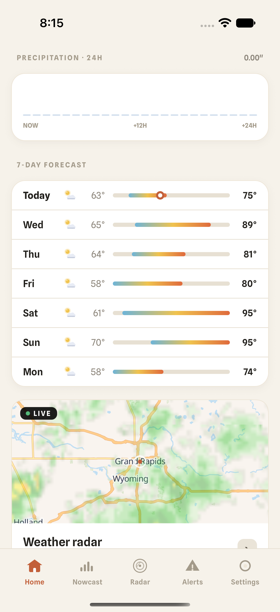
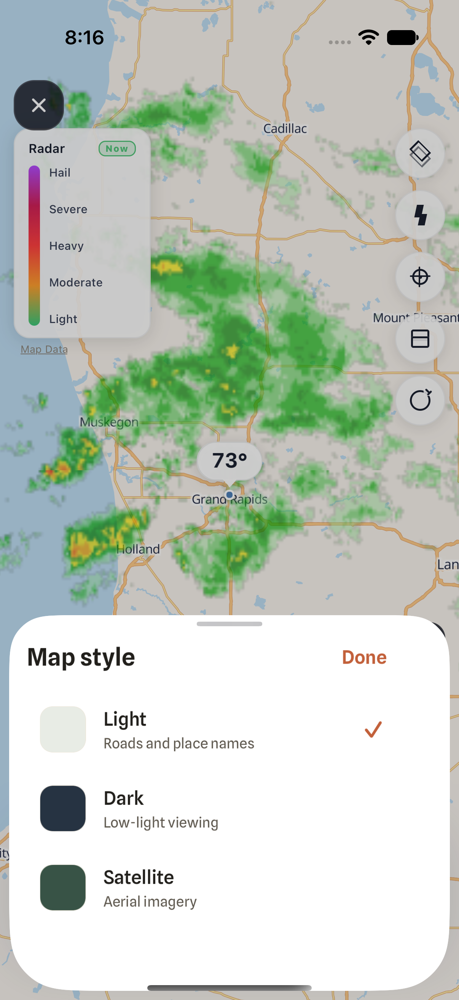
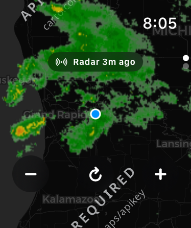
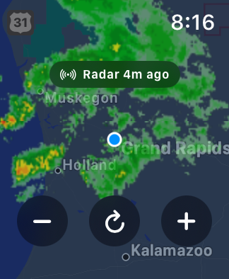

# iPhone and Apple Watch QA — September 8, 2026

This pass uses real release builds and the live Radar API. Simulator results do not
establish physical-device frame rate, thermal behavior, battery life, or car compatibility.

## Changes

- Updated Expo 57.0.4 → 57.0.21 and React Native 0.86.0 → Expo-supported 0.86.3,
  aligned Expo dependencies, and enabled React Compiler. A clean dependency install
  removed duplicate Expo modules. Expo Doctor passed all 21 checks.
- Fixed the clean-prebuild CocoaPods deployment-floor plugin for the SDK 57 Podfile
  template. Regression tests execute the generated Ruby against current and legacy
  templates, including idempotence and preserving newer deployment targets.
- Home radar now has a separate readable footer, consistent clipping, and neutral
  precipitation wording. It no longer overlays “Clear skies overhead” on radar returns.
- Map styles use a native bottom sheet. React content is hosted through RNHostView
  so its width and touch handling work inside the native presentation.
- Temperature units now affect Home and the radar marker and survive relaunch.
  Removed the duplicate city label that collided with basemap labels. Opacity persists.
- City result selection works with the keyboard open. Selecting a city or saving the
  server dismisses the keyboard; the URL field selects its contents for replacement.
- Radar playback follows the speed setting and stops ticking offscreen/backgrounded.
  Wind particles unmount offscreen, in the background, and with Reduce Motion enabled.
- Light precipitation is distinguished from a genuinely dry nowcast.
- Watch radar uses one native Apple map snapshot per viewport rather than CARTO
  tiles containing an “API KEY REQUIRED” watermark. It fetches only visible MRMS tiles.
- Watch controls have native SF Symbols, larger hit areas, and spoken labels.
  Forecast cards use native SwiftUI typography and surfaces, explicit missing-data
  states, a refresh action, and readable alert contrast.
- Watch location failure no longer recursively restarts all network requests. Refreshes
  are deduplicated, network requests time out, and foregrounding refreshes older data.
- Watch forecast hours no longer disappear because of offset-free API timestamps.
  The hourly strip starts at the current hour. The next-hour chart selects four
  upcoming 15-minute samples, replacing 60 entries starting at midnight. Date formatters
  are reused, and daily rows cannot index beyond mismatched response arrays.

## Verification

| Check | Result |
| --- | --- |
| iPhone 17 Pro, iOS 27 simulator | Five Maestro flows passed in 3m 17s |
| Final iPhone marker build | Navigation/screenshots and Celsius persistence flows passed again |
| Watch SE 3, 40 mm, watchOS 27 simulator | Three native XCTest cases passed |
| Watch Series 11, 42 mm | Three native XCTest cases passed with companion installed |
| JavaScript tests | 173 tests across 25 suites passed |
| TypeScript and Expo lint | Passed |
| Native Watch presentation checks | Passed: time labels, next-hour selection, missing data, tile URL |
| Native release build | iPhone and embedded Watch targets built successfully |
| Android production JS export | Passed; native Android runtime testing remains pending |

Maestro covers fresh launch with location denied; Home, Nowcast, Alerts, Settings,
and Radar; city search and persistence; light/dark/system appearance; unavailable
server and recovery; Celsius/Fahrenheit; playback, repeated timeline changes,
light/dark/satellite maps, radar/AQM layers, overlays, refresh, and foreground recovery.
Each flow begins with clean app state to prevent failed-server tests contaminating others.

Watch XCTest covers denied-location fallback, zoom and refresh buttons, forecast
navigation and scrolling, refresh and foreground recovery, and repeated launches.
The 40 mm release-build launch-to-responsive metric averaged **1.760 seconds** over
three measured runs (1.733, 1.713, 1.834 seconds; 3.0% relative standard deviation).
The paired 42 mm Watch averaged **1.568 seconds** (1.572, 1.558, 1.573 seconds;
0.425% relative standard deviation), with all three tests passing.
These are instrumented simulator baselines, not before/after speedup claims.

The paired 42 mm simulator needs its companion app installed on its paired iPhone.
With only the Watch app installed, the Watch app disappeared during the run. The
Watch runner now checks the paired phone before testing. A Maestro driver also
failed to bootstrap once on this beta Xcode runtime; reinstalling the driver resolved
that infrastructure failure before the successful five-flow run.

## Visual evidence

| iPhone radar card | Native map-style sheet |
| --- | --- |
|  |  |

| Watch before: broken provider tile | Watch after: Apple map and MRMS |
| --- | --- |
|  |  |

Additional captures: [Watch forecast](qa/2026-09-08/watch-40mm-forecast.png),
[denied location](qa/2026-09-08/watch-location-denied.png),
[iPhone nowcast](qa/2026-09-08/iphone-nowcast.png).

## Reproduce

See [Apple target setup](carplay-watch-setup.md). From `frontend`:

```sh
SIMULATOR_UDID=<iphone-uuid> bun run test:ios
WATCH_SIMULATOR_UDID=<watch-uuid> bun run test:watch
```

Use `IOS_SIMULATOR_APP_PATH` for the Watch runner when its paired phone needs the
companion app installed. iPhone reports are under `/tmp/radar-ios-qa`; Watch runs
print their output directory and retain an `.xcresult` bundle with screenshots and metrics.
The native test target lives in the generated Xcode project; its source and setup
script are tracked so Expo prebuild can regenerate it.

## Remaining device and backend gates

- Real iPhone and Watch testing: sustained playback, battery, thermal pressure,
  launch behavior without the debugger, Digital Crown feel, and VoiceOver audit.
  Simulator tests exercised touch zoom; physical Crown feel is not certified.
- Android emulator/physical-device navigation, permissions, native sheet behavior,
  and sustained playback. A JS export is not an Android runtime pass.
- CarPlay radar widget implementation and actual-car testing are queued behind
  Watch/iPhone quality work. No entitlement bypass or real-car compatibility is claimed.
- Watch units/server/location preferences are not synchronized with the phone;
  Watch uses its own location and the configured Radar endpoint. Watch alerts and
  the older full CarPlay map still have external-provider migration followups.
- The live forecast response had null condition codes and several null weather
  fields. Watch displays unavailable condition information rather than inventing icons.
- Keep `CAROUSEL_WINDOW=1` until the existing physical iPhone/Android performance
  gate is met. This pass does not authorize widening that window or deploying a backend.

Cluster checks were read-only: all six nodes Ready; Radar Argo application Synced
and Healthy; isolated Radar worker deployments running; public radar/forecast/nowcast
endpoints responding. Separate shared Temporal followups were captured in Mink.
