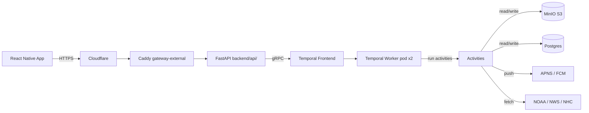
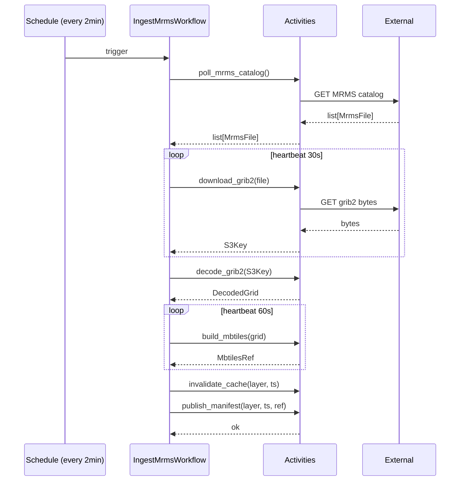
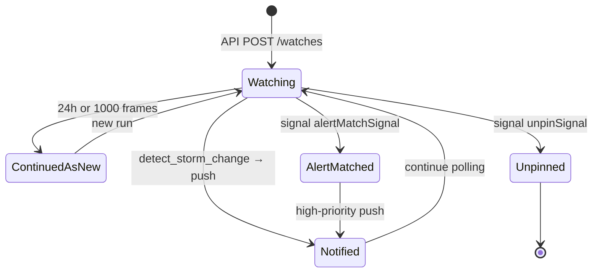
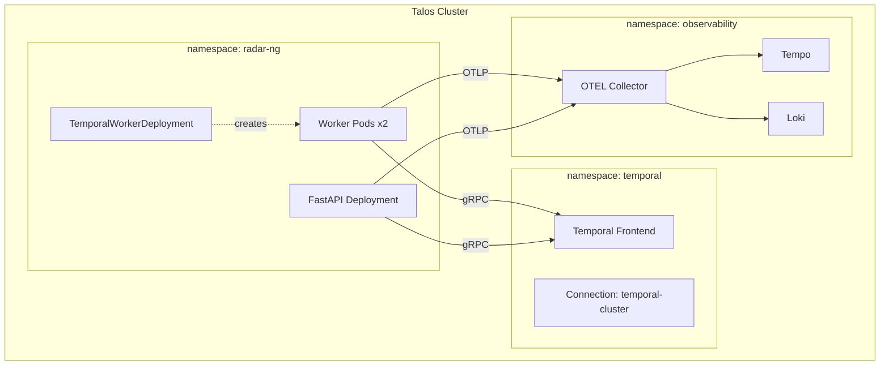

# Temporal-driven radar-ng — design spec

**Status:** APPROVED. Implementation may begin.
**Last updated:** 2026-05-01

---

## Goal

Replace every K8s CronJob in the radar-ng backend with [Temporal](https://temporal.io) workflows + Schedules, restructure the repo as a true monorepo (`frontend/` + `backend/` + `temporal/`), add a user-driven "Watch this storm" feature with push notifications, and use the result as a learning vehicle for Temporal in a real system. Personal project — complexity is acceptable, full docs + diagrams required.

## Non-goals (this round)

- Rewriting the API or any service in Rust (Phase 2 — gated on OTEL data showing where the slow path is).
- Bun workers (Bun + `@temporalio/worker` is experimental in TS SDK 1.15+; we picked Python for the worker so this doesn't apply).
- A first-party HTTP gateway for Temporal (doesn't exist; we proxy through `backend/api/`).
- Mobile app rewrite — UI changes shipped earlier today are out of scope here.

---

## Locked decisions (do NOT re-litigate without raising explicitly)

1. **Monorepo restructure** — three top-level directories by concern: `frontend/`, `backend/`, `temporal/`.
2. **All Python on backend, Bun + TS on frontend.** No polyglot. Temporal worker is Python (`temporalio` SDK), mirrors the news-reader pattern.
3. **No CronJobs survive.** All seven existing K8s CronJobs become Temporal Schedules with `Skip` overlap policy.
4. **Mobile never talks to Temporal directly.** Mobile → HTTPS → `backend/api/` → Python `temporalio.client.Client`. Auth + port exposure + RN gRPC pain are real and named.
5. **Storm-watch + push notifications are in scope for v1.** APNS/FCM with `apns-collapse-id` for retry dedupe. `WorkflowIdReusePolicy.AllowDuplicateFailedOnly`.
6. **Rust deferred to Phase 2.** Get it shipped in Python, instrument with OTEL, find slow paths, then convert hot ones.

---

## Section 1 — Repo structure

```
radar-ng/
├── frontend/                           # mobile app (everything currently at root)
│   ├── src/                            # Expo Router source
│   ├── android/  ios/  plugins/  targets/  assets/  __tests__/
│   ├── app.json  package.json  bun.lock  metro.config.js  tsconfig.json
│   └── …                               # everything that exists at root today
│
├── backend/
│   ├── api/                            # was services/tile-server/
│   │   ├── server.py                   # FastAPI, gains workflow endpoints
│   │   ├── temporal_client.py          # singleton temporalio.client.Client
│   │   ├── routes/
│   │   │   ├── tiles.py                # existing tile/manifest serving
│   │   │   ├── alerts.py               # NWS proxy
│   │   │   └── workflows.py            # NEW: storm-watch + push tokens
│   │   ├── Caddyfile  Dockerfile  requirements.txt
│   ├── ingest-mrms/                    # was services/ingest-mrms/
│   │   ├── activities.py               # NEW: Temporal activity wrappers
│   │   ├── ingest.py                   # existing logic (becomes pure functions)
│   │   ├── Dockerfile  requirements.txt
│   ├── ingest-hrrr/  ingest-lightning/  ingest-tropical/
│   ├── nowcast/                        # pysteps activity
│   ├── basemap/  tile-cleanup/  base/  shared/
│   └── …
│
├── temporal/                           # NEW: the worker + workflows
│   ├── worker.py                       # entrypoint — registers all workflows + activities
│   ├── workflows/
│   │   ├── ingest_mrms.py
│   │   ├── ingest_hrrr.py
│   │   ├── ingest_lightning.py
│   │   ├── ingest_tropical.py
│   │   ├── nowcast.py
│   │   ├── tile_cleanup.py
│   │   ├── poll_alerts.py
│   │   └── watch_storm.py
│   ├── schedules/
│   │   └── seed.py                     # idempotent — creates/updates Schedules on deploy
│   ├── shared/
│   │   ├── push.py                     # APNS/FCM activity
│   │   └── otel.py                     # OTEL span helpers
│   ├── Dockerfile  requirements.txt
│
├── .gitea/workflows/
│   ├── build-frontend.yml              # NEW (or skip if EAS handles it)
│   ├── build-api.yml                   # was build-tile-server.yml
│   ├── build-ingest-mrms.yml           # paths updated to backend/ingest-mrms/**
│   ├── build-ingest-hrrr.yml  build-ingest-lightning.yml
│   ├── build-ingest-tropical.yml  build-nowcast.yml
│   ├── build-basemap.yml  build-tile-cleanup.yml
│   ├── build-base.yml
│   ├── build-temporal-worker.yml       # NEW
│   └── retag-from-latest.yml
│
├── docs/
│   ├── ARCHITECTURE.md                 # high-level diagram + component map
│   ├── TEMPORAL.md                     # workflow catalog, schedules table, signals/queries
│   ├── RUNBOOK.md                      # deploy, debug, replay, backfill
│   └── superpowers/specs/<this spec>
│
└── README.md
```

**Activity-import pattern:** `temporal/workflows/ingest_mrms.py` imports activity functions from `backend/ingest-mrms/activities.py`. Worker startup in `temporal/worker.py`:

```python
from backend.ingest_mrms.activities import download_grib2, decode_grib2, build_mbtiles
worker = Worker(
    client,
    task_queue="radar-ng",
    workflows=[IngestMrmsWorkflow, ...],
    activities=[download_grib2, decode_grib2, build_mbtiles, ...],
)
```

Single task queue (`radar-ng`), single worker pod, all activities + workflows registered together. Split task queues later if perf demands.

---

## Section 2 — Workflow & schedule catalog

### Periodic pipeline workflows (driven by Temporal Schedules)

| Workflow | Schedule | Overlap | Activities (in order) | Replaces |
|---|---|---|---|---|
| `IngestMrmsWorkflow` | every 2 min | Skip | `pollMrmsCatalog` → `downloadGrib2` (heartbeat) → `decodeGrib2` → `buildMbtiles` (heartbeat) → `invalidateCache` → `publishManifest` | CronJob `ingest-mrms` |
| `IngestHrrrWorkflow` | every 15 min | Skip | `pollHrrrRun` → `downloadGrib2Layers` (heartbeat) → `decodeLayer` ×N → `buildMbtilesPerLayer` → `publishManifest` | CronJob `ingest-hrrr` |
| `IngestLightningWorkflow` | every 5 min | Skip | `fetchNldn` → `geojsonify` → `publishStrikeFile` | CronJob `ingest-lightning` |
| `IngestTropicalWorkflow` | every 1 h | Skip | `fetchNhcCones` → `parseShapefile` → `publishCones` | CronJob `ingest-tropical` |
| `NowcastWorkflow` | every 2 min | Skip | `loadLatestMrmsFrames` → `runPystepsExtrapolation` (heartbeat, expensive) → `buildNowcastTiles` → `publishNowcastManifest` | CronJob `nowcast` |
| `TileCleanupWorkflow` | every 1 h | Skip | `findExpiredTiles` → `deleteFromObjectStore` → `pruneIndex` | CronJob `tile-cleanup` |
| `PollAlertsWorkflow` | every 5 min | Skip | `fetchNwsActiveAlerts` → `diffSinceLastRun` → `for each new alert: signalMatchingStormWatches` | new |

All seven schedules created/updated by `temporal/schedules/seed.py`, run on worker container startup (idempotent). Pause/backfill/trigger via the `temporal` CLI or Web UI.

### Entity workflows (long-lived, per-user)

| Workflow | Lifetime | Trigger | Signals | Queries | Activities |
|---|---|---|---|---|---|
| `WatchStormWorkflow` | hours–days | mobile API call | `unpinSignal`, `alertMatchSignal` (from `PollAlertsWorkflow`) | `getCurrentState` | `compareRadarFrames` → `detectStormChange` → `sendPushNotification` |

- **Workflow ID:** `watch:{userId}:{stormCellId}` — unique, stable, no PII (userId is opaque uuid).
- **continue-as-new** every 24 h or 1000 frame comparisons to keep history under 50K events.
- **`WorkflowIdReusePolicy.AllowDuplicateFailedOnly`** — re-pinning a dissipated storm starts fresh.
- **Push dedupe:** every push activity uses `apns-collapse-id = ${workflowId}:${frameTimestamp}:${changeKind}`. Temporal retry → APNS sees the same id → user's phone buzzes once.

### One-shot workflows (API-triggered)

| Workflow | Caller | Purpose |
|---|---|---|
| `RegisterPushTokenWorkflow` | `POST /push-tokens` | Wraps push-token persist for observability — every registration appears as a workflow run with its own trace. |

### What this replaces

- All seven K8s CronJobs deleted. Argo manifests for those services lose their CronJob CRDs and gain a single `TemporalWorkerDeployment` CR (per news-reader pattern).
- `PollAlertsWorkflow` is new — today's alert flow is mobile-app-only (RN polls NWS directly). We move it server-side so severe alerts can push to phones even when the app is closed.

---

## Section 3 — Activity contracts (retries, heartbeats, idempotency)

**Standard retry policy** (default for all activities):
- `initial_interval=1s`, `backoff=2.0`, `max_interval=100s`, `max_attempts=5`
- Non-retryable: `ApplicationError(non_retryable=True)` for malformed input, 4xx auth failures

**Activity catalog:**

| Activity | Sig (in → out) | Heartbeat | Timeout | Retry override | Idempotency key |
|---|---|---|---|---|---|
| `poll_mrms_catalog` | `productId:str → list[MrmsFile]` | — | 30s | default | read-only |
| `download_grib2` | `MrmsFile → S3Key` | 30s | 10m | default | url SHA → S3 key (deterministic) |
| `decode_grib2` | `S3Key → DecodedGrid` | — | 5m | default | input hash → output hash |
| `build_mbtiles` | `DecodedGrid → MbtilesRef` | 60s | 10m | default | grid hash → mbtiles path |
| `invalidate_cache` | `(layer, ts) → None` | — | 30s | 3 attempts | delete is idempotent |
| `publish_manifest` | `(layer, ts, ref) → None` | — | 30s | 10 attempts (must succeed) | atomic JSON swap |
| `poll_hrrr_run` | `() → HrrrRun` | — | 60s | default | read-only |
| `download_grib2_layers` | `(HrrrRun, layers) → list[S3Key]` | 60s | 30m | default | per-file url SHA |
| `fetch_nldn` | `() → StrikeBatch` | — | 30s | default | read-only |
| `geojsonify` | `StrikeBatch → GeoJSON` | — | 30s | default | input hash |
| `fetch_nhc_cones` | `() → list[Storm]` | — | 60s | default | read-only |
| `load_latest_mrms_frames` | `count → list[Frame]` | — | 30s | default | read-only |
| `run_pysteps_extrapolation` | `list[Frame] → Forecast` | 15s | 5m | **2 attempts** (CPU-bound, deterministic) | input hash |
| `build_nowcast_tiles` | `Forecast → MbtilesRef` | 60s | 5m | default | forecast hash |
| `find_expired_tiles` | `retention → list[TileRef]` | — | 5m | default | read-only |
| `delete_from_object_store` | `list[TileRef] → int` | 30s | 10m | default | per-key delete |
| `prune_index` | `list[TileRef] → None` | — | 30s | default | DB delete |
| `fetch_nws_active_alerts` | `() → list[Alert]` | — | 30s | default | read-only |
| `signal_matching_storm_watches` | `Alert → int` | — | 30s | default | signal id = `(alertId, watchId)` |
| `compare_radar_frames` | `(prev, curr) → Diff` | — | 60s | default | input hashes |
| `detect_storm_change` | `(Diff, threshold) → ChangeKind\|None` | — | 5s | default | pure |
| `send_push_notification` | `(PushToken, Payload) → None` | — | 30s | **3 attempts, fail on 4xx** (BadDeviceToken → unregister) | `apns-collapse-id = workflowId:frameTs:changeKind` |
| `persist_push_token` | `(userId, token, platform) → None` | — | 5s | default | DB upsert |

**Conventions:**
- Activities are pure functions of inputs (no hidden side state) — outputs deterministic given inputs
- All long ops (`download_*`, `build_*`, `run_pysteps_*`) heartbeat
- All `publish_*` activities are last-step commits — high retry, idempotent writes only
- Output types are typed dataclasses in `backend/shared/types.py`, importable by both worker and API

---

## Section 4 — Mobile → API → Temporal call patterns

**REST surface on `backend/api/`** (all under `/v1/`):

| Method + path | Body | Action | Returns |
|---|---|---|---|
| `POST /push-tokens` | `{userId, token, platform}` | start `RegisterPushTokenWorkflow` | `{workflowId, runId}` |
| `DELETE /push-tokens/:token` | — | direct DB delete | 204 |
| `POST /watches` | `{stormCellId, lat, lng}` | start `WatchStormWorkflow` id=`watch:{userId}:{stormCellId}` | `{workflowId}` |
| `DELETE /watches/:stormCellId` | — | signal `unpinSignal` to workflow | 204 |
| `GET /watches/:stormCellId` | — | query `getCurrentState` | `{lastFrameTs, lastChangeKind, lastNotifiedAt}` |
| `GET /watches` | — | DB read of active-watches projection | `[{stormCellId, ...}]` |
| `GET /workflows/:workflowId/status` | — | `client.get_workflow_handle(...).describe()` | `{status, runId, startedAt}` |

**Auth:** bearer JWT (existing pattern). `userId` = opaque uuid in token claims; never logged.

**Mobile polling cadence:**
- Watch detail screen open: `GET /watches/:id` every 30s, stop on app background
- Watch list: pull-to-refresh + on tab focus
- No long-poll/SSE in v1 — push notifications are the live channel

**Error mapping (Temporal → HTTP → mobile):**
- `WorkflowAlreadyExists` → 409 → mobile: "Already watching"
- `WorkflowNotFound` (query on dead workflow) → 410 Gone → mobile: drop from list
- Activity-level failure → workflow continues retrying → API never sees it → mobile polling shows stale state, no error
- API → Temporal connection dead → 503 → mobile: queued retry banner

**Latency budget:** API → Temporal `start_workflow` ≈ 50ms; workflow scheduling <1s; mobile sees ack ≈ 500ms end-to-end.

---

## Section 5 — Deployment topology

**`TemporalWorkerDeployment` CR** (per news-reader pattern, namespace `radar-ng`):

```yaml
apiVersion: temporal.io/v1beta1
kind: TemporalWorkerDeployment
metadata: { name: radar-ng-worker, namespace: radar-ng }
spec:
  replicas: 2  # HA, schedule fan-out is small
  image: gitea.vanillax.me/vanillax/radar-ng-temporal-worker:${TAG}
  taskQueue: radar-ng
  temporalConnection: { name: temporal-cluster }
  env:
    - name: OTEL_EXPORTER_OTLP_ENDPOINT
      value: http://opentelemetry-collector.observability:4317
  envFrom:
    - configMapRef: { name: radar-ng-storage }
    - configMapRef: { name: radar-ng-noaa-endpoints }
    - secretRef:    { name: radar-ng-worker-secrets }
```

**ConfigMaps:**
- `radar-ng-storage`: S3 endpoint + bucket
- `radar-ng-tile-config`: zoom ranges, tile sizes, retention windows
- `radar-ng-noaa-endpoints`: MRMS/HRRR/NLDN/NHC URLs (overridable for tests)

**Secrets:**
- `radar-ng-worker-secrets`: `APNS_KEY` + `APNS_TEAM_ID` + `APNS_KEY_ID`, `FCM_SERVER_KEY`, `S3_ACCESS_KEY` + `S3_SECRET_KEY`, `NWS_API_TOKEN`
- `radar-ng-api-secrets`: `JWT_SIGNING_KEY` (existing)

**API deployment:** existing FastAPI service, gains mount of `temporal-cluster` Connection + `TEMPORAL_NAMESPACE=radar-ng` env. HTTPRoute on `gateway-external` with `external-dns: "true"` label.

**OTEL wiring:**
- Worker: `temporalio.contrib.opentelemetry.TracingInterceptor` → spans per workflow + activity → OTLP gRPC → Collector → Tempo
- API: existing FastAPI OTEL middleware → span continues into `client.start_workflow` (W3C trace context)
- Logs: structured JSON via `loguru` → stdout → vector → Loki with `service_name=radar-ng-temporal-worker`, `k8s_namespace_name=radar-ng` (OTEL semconv)

**Schedule seeding:**
- `temporal/schedules/seed.py` runs as initContainer on worker pod
- Idempotent: try `client.create_schedule` → on `AlreadyExists` → `handle.update(...)`
- Pause/backfill/trigger via `temporal schedule` CLI or Web UI — never via code

**Image build + Renovate:**
- Gitea Actions: `build-temporal-worker.yml` triggers on `temporal/**` + `backend/shared/**` changes, tags `${shortSHA}` + `latest`
- Renovate watches `gitea.vanillax.me/vanillax/radar-ng-temporal-worker` → PR against argocd manifest on new SHA
- Same flow as existing services

---

## Section 6 — Error handling + testing

**Three error layers:**
1. **Activity:** retry policy table above. Non-retryable raises `ApplicationError(non_retryable=True)` → workflow sees failure.
2. **Workflow:** wrap activity calls for *expected* exits (MRMS catalog empty = no-op return, not error). Unexpected exception → workflow fails → history preserved → manual replay/retry via Temporal UI.
3. **Schedule:** `OverlapPolicy.SKIP` (slow run doesn't queue), `CatchupWindow=1h` (no thundering-herd backfill on worker recovery).

**Test strategy:**

| Layer | Tool | What it covers |
|---|---|---|
| Activity unit | `pytest` + `respx` + `moto` | ~95% of logic, no Temporal at all |
| Workflow replay | `temporalio.testing.WorkflowEnvironment` | sequence + final state with mocked activities — one per workflow |
| History regression | `temporalio.worker.Replayer` against committed `*.history.json` | catches non-deterministic workflow changes that break in-flight runs |
| Smoke | `SmokeTestSchedule` runs hourly against tiny test product | failure pages |
| Integration | `docker compose up` (Temporal dev server + worker + API + minio) | `make test-integration`, pre-merge |

**Runbook (`docs/RUNBOOK.md`) covers:**
- Workflow stuck → Temporal UI → activity history → retry exhaustion → terminate + retrigger
- Push notifications missing → Loki query on `send_push_notification` → APNS error code → unregister bad token via API
- Worker pod CrashLoop → `kubectl logs` → usually missing secret or temporal connection
- Backfill 6h MRMS → `temporal schedule backfill --schedule-id=ingest-mrms --start-time=... --overlap-policy=AllowAll`
- Replay from history → `temporal workflow replay --history=hist.json` against local worker

---

## Section 7 — Diagrams

### System topology



### IngestMrms workflow lifecycle



### WatchStorm workflow lifecycle



### Talos deployment topology



---

## Implementation phases

Per locked decision #6, Rust is deferred. Implementation proceeds in this order:

1. **Phase 0 — Monorepo restructure.** `git mv` mobile app to `frontend/`, services/ → backend/, scaffold `temporal/`. Update `.gitea/workflows/` paths. No behavior changes.
2. **Phase 1 — Worker scaffold + first workflow.** Stand up `temporal/worker.py`, port `IngestMrmsWorkflow` end-to-end including Schedule seed. Smoke test against Talos Temporal cluster.
3. **Phase 2 — Port remaining ingest workflows.** HRRR, lightning, tropical, nowcast, tile-cleanup. Delete CronJobs as each replacement runs green for 24h.
4. **Phase 3 — Server-side alert polling + storm-watch.** `PollAlertsWorkflow`, `WatchStormWorkflow`, `RegisterPushTokenWorkflow`. APNS/FCM integration. Mobile API endpoints.
5. **Phase 4 — Observability + runbook.** OTEL polish, Grafana dashboards for workflow/activity metrics, full runbook walkthrough.
6. **Phase 5 (deferred) — Rust hot paths.** Convert `decode_grib2` + `build_mbtiles` if OTEL data shows them as bottlenecks.
